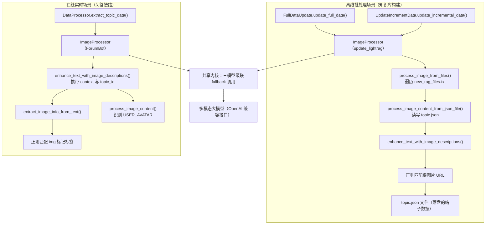

# 多模态图片处理：文档图片内容增强

## 1. 项目定位与核心价值

### 背景与痛点

论坛型知识库有一个天生的短板：大量关键信息并非以纯文本形式存在，而是以**截图**的形式贴在帖子里——错误日志的终端截图、BMC 管理界面的配置截图、代码片段的 IDE 截图。这类内容对人类读者一目了然，但对纯文本驱动的检索增强生成（RAG）系统而言却是一片"语义黑洞"：无论是 LightRAG 的图谱构建阶段，还是后续的向量检索阶段，处理的对象始终是文本 token，一个孤立的图片 URL（如 `https://discuss.openubmc.cn/uploads/xxx/screenshot.png`）不会被分词器赋予任何有意义的语义向量，图中承载的报错码、配置项、命令行输出等关键信息就此彻底流失。如果不做处理，知识库对这类问题的召回能力会出现明显盲区——用户报的错明明在截图里写得清清楚楚，系统却"看不见"。

`ImageProcessor` 正是为解决这一问题而设计的**多模态内容增强器**。它的核心思路很直接：在文本进入知识库（无论是首次冷启动导入还是运行时问答链路）之前，先扫描出文本里所有的图片引用，逐一调用具备视觉理解能力的多模态大模型，将图片"翻译"成一段结构化的文字描述，再把原始图片标记替换为这段描述文字，从而让图片承载的信息以文本形式重新进入检索管道。值得注意的是，该项目中存在**两套独立实现**的 `ImageProcessor`——分别位于 `src/update_lightrag/image_processor.py` 与 `src/ForumBot/image_processor.py`——二者共享同一套"多模型 fallback 调用"内核，但服务的场景与文本解析策略截然不同：前者面向**离线批处理**（冷启动/增量更新流程中处理落盘的 `topic.json` 文件），后者面向**在线实时处理**（问答链路中即时增强单条帖子文本）。这种"同名不同类、各司其职"的设计体现了该项目对不同数据流特征的精细适配，而非简单的代码复用。

### 核心特性解析

**多模型级联容错（Model Fallback Chain）** 是两套实现共有的核心韧性设计。配置中的 `image_processing.model1/model2/model3` 定义了三个候选多模态模型，`_call_multimodal_model`（ForumBot 版本）/`_call_multimodel_model`（update_lightrag 版本）内部用一个 `for` 循环依次尝试，一旦某个模型抛出异常就自动切换到下一个，只有当**最后一个模型也失败**时才向上抛出异常终止处理。这种设计对图片处理场景尤为重要：多模态模型的可用性普遍不如纯文本模型稳定（涨点快、限流严、偶发超时），单一模型依赖会让整条数据处理流水线因为一次瞬时故障而彻底中断，三级 fallback 链把这种单点故障的概率降到了可接受范围。

**Token 用量可观测性** 是 ForumBot 版本额外具备的能力。`_call_multimodal_model` 在成功调用后会检查 `topic_id` 是否存在，若存在则将 `response.usage` 中的 `prompt_tokens`、`completion_tokens`、`total_tokens` 累加进全局 `token_tracker`，这使得每一个帖子在问答生成全过程（包括图片理解这一步）消耗的算力成本都能被精确核算，为后续的成本审计和模型选型决策提供数据支撑。而 `update_lightrag` 版本由于运行在离线批处理场景，不涉及单帖子的成本归因，因此省略了这一逻辑，体现了"按场景取舍功能"的工程克制。

Sources: [image_processor.py](src/ForumBot/image_processor.py#L73-L117), [image_processor.py](src/update_lightrag/image_processor.py#L38-L73), [token_tracker.py](src/ForumBot/token_tracker.py#L1-L23)

---

## 2. 架构设计与模块划分

### 双实例拓扑：离线批处理 vs 在线实时增强



### 模块职责详解

| 组件 | 源文件 | 运行场景 | 核心职责 |
|---|---|---|---|
| `ImageProcessor`（update_lightrag） | `src/update_lightrag/image_processor.py` | 离线批处理，冷启动 & 增量更新 | 扫描 `topic.json` 全文中的裸图片 URL，就地替换为描述文本，写回文件 |
| `ImageProcessor`（ForumBot） | `src/ForumBot/image_processor.py` | 在线实时，问答生成前的文本预处理 | 解析 `[img: (url)]` 标记标签，区分用户头像与技术截图，按上下文差异化提示词 |
| `FullDataUpdate` / `UpdateIncrementData` | `full_data_init.py` / `increment_date_update_timer.py` | 调用方 | 在批量上传 LightRAG 前触发图片增强步骤 |
| `DataProcessor` | `src/ForumBot/data_processor.py` | 调用方 | 在提取帖子结构化数据（`extract_topic_data`）时，对用户问题与最佳答案分别调用增强 |
| `token_tracker` | `src/ForumBot/token_tracker.py` | 依赖方（仅 ForumBot 版本） | 记录多模态模型调用的 token 消耗，按 `topic_id` 归因 |

**update_lightrag 版本的 `ImageProcessor`** 定位是"批量文件级"处理器。其入口 `process_image_from_files(file_list_path)` 读取增量/全量流程产出的 `new_rag_files.txt`，过滤出以 `topic.json` 结尾的文件（因为文档类 Markdown 文件通常不含外部图片引用），逐一调用 `process_image_content_from_json_file`。这个方法会把 JSON 中的 `question` 字段和所有 `reply_posts[*].text` 字段分别送入 `enhance_text_with_image_descriptions`，处理完成后**直接覆写原文件**。这种"原地修改磁盘文件"的设计将图片增强做成了一道独立于主流水线的预处理关卡，主流程（`Filter` → `ImageProcessor` → 上传）之间通过文件系统解耦，任何一环出问题都能单独重跑，不需要引入复杂的中间状态管理。

**ForumBot 版本的 `ImageProcessor`** 定位是"文本片段级"实时增强器，服务于问答生成链路中 `DataProcessor.extract_topic_data` 这一步。它接收的文本已经经过 `process_html_content_with_image_links` 从原始 HTML `cooked` 内容转换而来，图片标签被统一规整为 `[img: (url)]` 格式（相对路径或绝对路径均可）。这一版本额外识别了一种特殊情形——**用户头像**：只要图片 URL 中包含 `user_avatar` 关键字，直接返回 `USER_AVATAR` 标记而不调用模型，调用方随后会把该标签整体删除而非替换为描述文字，避免头像图片消耗宝贵的模型调用配额与 Token 预算。

Sources: [image_processor.py](src/update_lightrag/image_processor.py#L100-L154), [image_processor.py](src/ForumBot/image_processor.py#L23-L71), [data_processor.py](src/ForumBot/data_processor.py#L1036-L1059), [full_data_init.py](src/update_lightrag/full_data_init.py#L109-L111)

---

## 3. 技术栈与核心工作流

### 执行主链路对比

两套实现在流程骨架上高度相似，均遵循"识别图片引用 → 逐一调用多模态模型 → 拼接描述文本替换原标记"的三段式结构，但**图片识别策略**与**提示词构造策略**存在显著差异：

| 环节 | update_lightrag 版本 | ForumBot 版本 |
|---|---|---|
| 图片识别方式 | 正则匹配裸 URL：`https?://[^\s]+?\.(?:png\|jpg\|jpeg\|gif\|bmp\|webp)` | 正则匹配标记标签：`\[img: \((.*?)\)\]`，支持相对路径通过 `urljoin` 拼接为绝对 URL |
| 上下文感知 | 无（统一使用同一套提示词） | 有：区分 `user_question` / `best_answer` / 默认三种上下文，分别定制提示词 |
| 特殊情形处理 | 无 | 识别 `user_avatar` 关键字，跳过模型调用直接删除标签 |
| 异常兜底策略 | 返回原始 `image_url`（保留链接，不丢信息） | 返回固定文案"图像内容分析失败" |
| Token 统计 | 无 | 有，通过 `token_tracker` 按 `topic_id` 归因 |
| 数据落地方式 | 直接覆写 `topic.json` 磁盘文件 | 返回增强后的字符串，由调用方决定如何使用（写入内存字典字段） |

这两种差异本质上源于各自所处流水线阶段的性质：update_lightrag 版本工作在**批处理、无用户会话上下文**的场景，因此选用最简单可靠的裸 URL 正则识别（因为落盘的论坛原始 JSON 数据里图片就是以裸链接形式散落在文本中）；而 ForumBot 版本工作在**已经过 HTML→Markdown 转换**的结构化文本上，图片位置已被 `process_html_content_with_image_links` 统一规整为 `[img: (url)]` 标记，因此可以进行更精细的标签级解析和上下文相关的提示词定制。

Sources: [image_processor.py](src/update_lightrag/image_processor.py#L75-L98), [image_processor.py](src/ForumBot/image_processor.py#L23-L71), [data_processor.py](src/ForumBot/data_processor.py#L301-L339)

### 多模态模型调用核心方法一览

| 方法 | 所在文件 | 作用 |
|---|---|---|
| `extract_image_info_from_text` | `ForumBot/image_processor.py` | 用正则从文本抽取 `[img: (url)]` 标签，返回 `{url, original_tag}` 列表，支持相对路径拼接 |
| `process_image_content` | 两版本均有 | 单张图片的处理入口，区分用户头像 / 空 URL / 正常情形，构造上下文相关提示词并触发模型调用 |
| `_call_multimodal_model` / `_call_multimodel_model` | 两版本均有 | 真正发起 OpenAI 兼容接口调用的底层方法，内含三模型级联重试逻辑 |
| `enhance_text_with_image_descriptions` | 两版本均有 | 编排层方法，遍历所有识别出的图片并逐一替换为描述文本，返回增强后的完整文本 |
| `process_image_content_from_json_file` | `update_lightrag/image_processor.py` | 批处理专属，读取单个 `topic.json`，处理 `question` 与 `reply_posts[*].text` 两类字段并覆写磁盘 |
| `process_image_from_files` | `update_lightrag/image_processor.py` | 批处理入口，读取待处理文件清单，筛出 `topic.json` 逐一调用上一方法 |

---

## 4. 典型代码示例

### 示例一：ForumBot 版本——上下文相关的提示词构造

图片描述的质量高度依赖提示词是否贴合场景。ForumBot 版本根据文本来源（用户提问 vs 最佳答案）动态切换提示词策略：

```python
# src/ForumBot/image_processor.py  L57-L63
if "user_question" in context:
    prompt = "请详细描述这张图片中的内容，这是一张技术论坛中的截图，可能包含错误日志、配置界面或代码片段。请提取图中的文字信息。只保留来自截图中的信息，不要加你的总结或推测。"
elif "best_answer" in context:
    prompt = "请分析这张图片中的技术内容，这可能包含解决方案截图、配置示例或日志分析结果。请总结关键信息。"
else:
    prompt = "请描述这张技术图片的内容，重点关注其中的技术信息和关键细节。"
```

用户提问场景严格要求"只保留截图信息，不要总结或推测"，因为用户报错截图中的每一个字符（如具体的错误码）都可能是诊断问题的关键证据，AI 的主观总结反而会引入信息损耗甚至误导；而最佳答案场景则允许"总结关键信息"，因为此时图片通常是解决方案的辅助说明，提炼要点比逐字转录更有利于后续检索匹配。

### 示例二：三模型级联 fallback 核心逻辑

```python
# src/ForumBot/image_processor.py  L80-L114
for i, model in enumerate(models):
    try:
        response = self.client.chat.completions.create(
            model=model,
            messages=[{
                'role': 'user',
                'content': [
                    {'type': 'text', 'text': prompt},
                    {'type': 'image_url', 'image_url': {'url': image_url}},
                ],
            }],
            stream=False
        )
        if topic_id and hasattr(response, 'usage'):
            token_tracker.add_usage(
                topic_id,
                prompt_tokens=response.usage.prompt_tokens,
                completion_tokens=response.usage.completion_tokens,
                total_tokens=response.usage.total_tokens
            )
        return response.choices[0].message.content
    except Exception as e:
        logger.error(f"Error calling model {model}: {e}")
        if i == len(models) - 1:
            raise e
        else:
            logger.info(f"Retrying with next model: {models[i + 1]}")
```

这段代码使用了 OpenAI Chat Completions API 的多模态消息格式，`content` 数组中同时包含 `text` 与 `image_url` 两种类型的条目，这是当前主流多模态大模型（如 Qwen-VL、GPT-4V 兼容接口）统一遵循的输入协议。循环体内 `raise e` 只在最后一个模型失败时触发，确保前两次失败都是"静默重试"，只有彻底无路可退才会向上抛出异常，由调用方 `process_image_content` 的 `try/except` 兜底捕获。

### 示例三：update_lightrag 版本——JSON 文件级原地增强

```python
# src/update_lightrag/image_processor.py  L100-L125
def process_image_content_from_json_file(self, json_file_path):
    with open(json_file_path, 'r', encoding='utf-8') as f:
        data = json.load(f)

    question_text = data.get('question', '')
    if question_text:
        data['question'] = self.enhance_text_with_image_descriptions(question_text)

    for post in data.get('reply_posts', []):
        post_text = post.get('text', '')
        if post_text:
            post['text'] = self.enhance_text_with_image_descriptions(post_text)

    with open(json_file_path, 'w', encoding='utf-8') as f:
        json.dump(data, f, ensure_ascii=False, indent=2)
```

这一方法体现了"读-改-写"的原地更新模式：它不返回任何值，处理效果直接体现在磁盘文件的变化上。这种设计选择使得批处理流程可以完全通过文件系统状态来驱动——上层的 `process_image_from_files` 只需要遍历文件清单并逐一调用，无需在内存中维护任何跨文件的状态。

Sources: [image_processor.py](src/ForumBot/image_processor.py#L57-L117), [image_processor.py](src/update_lightrag/image_processor.py#L100-L125)

---

## 5. 关键设计决策剖析

### 为什么图片处理要放在上传前而非检索时

> 图片语义信息的转换成本应该在数据写入阶段一次性支付，而不是在每次检索命中时重复计算。

如果把图片理解的调用推迟到检索或问答生成阶段执行，同一张图片可能在每次相关问题被提问时都重新调用一次多模态模型，浪费大量重复算力。该项目选择在**数据进入知识库之前**（`ImageProcessor.process_image_from_files`）或者**数据进入问答生成上下文之前**（`enhance_text_with_image_descriptions` 在 `extract_topic_data` 中的调用）完成图片到文本的转换，是一次性投入换取长期复用收益的典型工程权衡。

### 为什么两个场景不共用一个类

从代码层面看，`ImageProcessor` 在两个目录下各有一份几乎同构但细节不同的实现，若做过度抽象合并成单一类反而会引入大量 `if scenario == 'offline'` 式的分支判断，破坏各自代码路径的可读性。该项目选择"接口相似但代码独立"的做法，是在牺牲一部分 DRY（Don't Repeat Yourself）原则的前提下，换取每个场景内部逻辑的清晰与独立演进空间——例如 ForumBot 版本未来若要新增更多上下文类型，完全不会影响 update_lightrag 版本的稳定性。

Sources: [full_data_init.py](src/update_lightrag/full_data_init.py#L93-L111), [data_processor.py](src/ForumBot/data_processor.py#L1017-L1059)

---

## 6. 学习与探索建议

| 方向 | 关联文件 | 核心关注点 |
|---|---|---|
| 批处理调用链路 | `src/update_lightrag/full_data_init.py`、`src/update_lightrag/increment_date_update_timer.py` | 图片增强步骤在冷启动/增量流水线中的具体触发时机与前后依赖 |
| HTML→Markdown 转换 | `src/ForumBot/data_processor.py` 中的 `process_html_content_with_image_links` | 图片标签如何从原始 `` HTML 元素规整为 `[img: (url)]` 文本标记 |
| Token 成本核算 | `src/ForumBot/token_tracker.py` | 多模态模型调用的 token 统计如何按 `topic_id` 归因，支撑成本审计 |
| 配置驱动的模型选择 | `config/config.yaml` 中的 `image_processing` 段 | `model1/model2/model3` 三级 fallback 链的配置结构与 `base_url` 拼接规则 |
| 问答链路的上游调用 | `src/ForumBot/data_processor.py` 的 `extract_topic_data` | 用户问题与最佳答案两种文本分别调用图片增强的具体位置与上下文标记传递方式 |

## 🔗 关联模块与上下游

- **上游调用方（批处理）**：[`full_data_init.py`](src/update_lightrag/full_data_init.py#L109-L111)、[`increment_date_update_timer.py`](src/update_lightrag/increment_date_update_timer.py#L188) — 冷启动与增量更新流程在上传 LightRAG 前触发图片增强
- **上游调用方（实时问答）**：[`data_processor.py`](src/ForumBot/data_processor.py#L1036-L1059) — `DataProcessor.extract_topic_data` 在结构化提取帖子时对用户问题和最佳答案分别调用增强
- **依赖组件**：[`token_tracker.py`](src/ForumBot/token_tracker.py) — ForumBot 版本用于记录每次多模态调用的 Token 消耗
