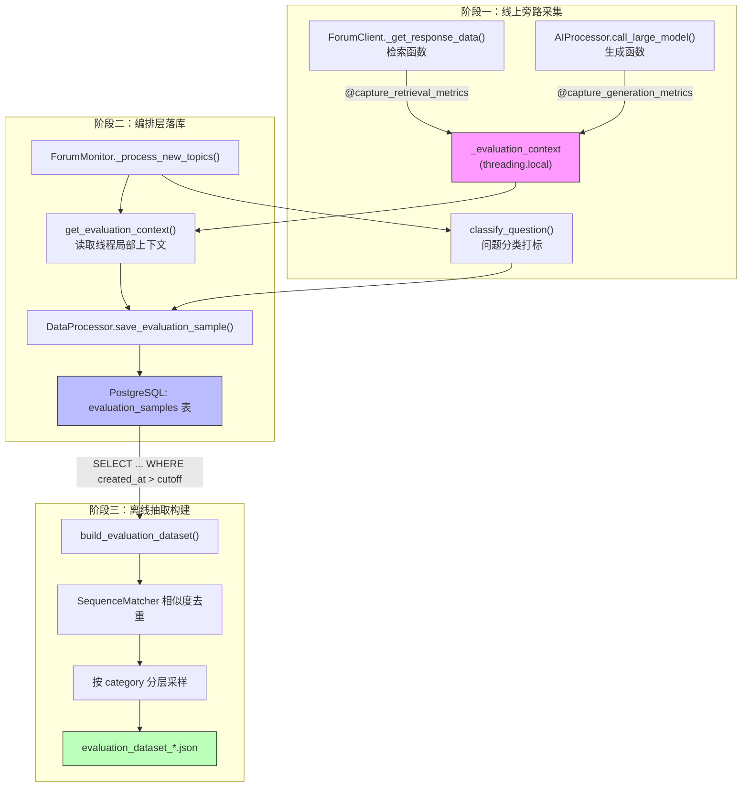

## 项目定位与核心价值

任何一个把大模型放到生产链路上跑的系统，迟早会遇到同一个问题：**线上到底跑得好不好？** Prometheus 里的延迟直方图能告诉你"快不快"，但回答不了"准不准""有没有胡说"这类语义层面的问题。要回答这些问题，唯一可靠的路径是把真实生产流量沉淀成一份**离线评估数据集**，再用它去跑 RAG 三元组指标（Answer Relevancy / Faithfulness / Context Precision）之类的 LLM-as-judge 评估。`src/evaluation/build_dataset.py` 正是这条链路的起点：它从生产数据库里捞取历史问答样本，去重、分类、按类别采样，最终吐出一份可以直接喂给评估脚本（`run_baseline.py`）的 JSON 数据集。

而这份数据集从何而来，是一个更值得细品的设计问题。ForumBot 采用的是**旁路采集（sidecar capture）**而非在业务代码里手工埋点：`src/ForumBot/evaluation_hooks.py` 用两个装饰器 `capture_retrieval_metrics` 和 `capture_generation_metrics`，分别挂在检索函数和生成函数上，在函数执行前后自动记录耗时，并把结果写入线程局部（`threading.local`）的上下文对象。业务代码本身完全不知道自己正在被"观测"——这是一种典型的 AOP（面向切面编程）式注入，好处是检索、生成两大核心函数的签名和逻辑保持零污染，采集逻辑可以独立开关、独立测试，甚至临时移除也不影响主链路运行。`classify_question` 则给每条样本打上业务类别标签（技术问题/使用问题/社区规则/其他），为后续"按类别分层采样"提供了依据。两者共同构成了"生产环境埋点 → 数据库落库 → 离线抽取构建数据集"的完整闭环。

Sources: [build_dataset.py](src/evaluation/build_dataset.py), [evaluation_hooks.py](src/ForumBot/evaluation_hooks.py)

## 架构设计与模块划分

从数据流角度看，整套评估数据集构建体系横跨三个阶段：**线上采集 → 持久化落库 → 离线抽取构建**。三个阶段分别由不同的模块承担职责，彼此通过数据库表和线程局部变量解耦，任何一环出错都不会打断主业务流程。



**阶段一（旁路采集层）**由 `evaluation_hooks.py` 独立承担。它不依赖任何具体业务模块，只提供两个装饰器和一个分类函数，是整套体系里唯一的"零依赖"模块，因此可以被 `forum_client.py`（检索）和 `ai_processor.py`（生成）分别导入使用而不产生循环依赖。

**阶段二（编排落库层）**由 `ForumMonitor`（`monitor.py`）主导，在处理完每个帖子后，无论答案是否合格、是否成功发布，都会调用 `get_evaluation_context()` 取出线程局部存储的检索/生成延迟与上下文，结合 `classify_question` 打类别标签，一并写入 `evaluation_samples` 表，同时同步更新 Prometheus 指标。

**阶段三（离线构建层）**即本文档核心 `build_dataset.py`，作为一个独立可执行脚本运行，与在线服务完全解耦，只在需要生成评估集时手动或定时触发。

Sources: [evaluation_hooks.py](src/ForumBot/evaluation_hooks.py#L1-L67), [monitor.py](src/ForumBot/monitor.py#L15,L393-L420,L509-L536), [data_processor.py](src/ForumBot/data_processor.py#L1216-L1265), [build_dataset.py](src/evaluation/build_dataset.py)

## 技术栈与核心工作流

### 采集层：装饰器与线程局部存储

`evaluation_hooks.py` 的设计核心是 `threading.local()` 实例 `_evaluation_context`。由于 ForumBot 是多线程/多协程处理多个帖子的批处理系统，如果用全局变量存储"当前这次检索/生成的延迟"，并发场景下会互相污染；`threading.local` 天然保证了每个线程拿到的是隔离的独立副本。

```python
_evaluation_context = threading.local()


def get_evaluation_context():
    return _evaluation_context


def capture_retrieval_metrics(func):
    @functools.wraps(func)
    def wrapper(*args, **kwargs):
        start_time = time.time()
        try:
            related_docs, data = func(*args, **kwargs)
            latency = time.time() - start_time
            ctx = get_evaluation_context()
            ctx.retrieval_context = related_docs
            ctx.retrieval_latency = latency
            ctx.retrieval_data = data
            return related_docs, data
        except Exception as e:
            logger.warning(f"数据采集钩子异常(检索节点): {e}")
            ctx = get_evaluation_context()
            ctx.retrieval_context = None
            ctx.retrieval_latency = None
            ctx.retrieval_data = None
            return func(*args, **kwargs)
    return wrapper
```

值得注意两个装饰器在异常处理上的**不对称设计**：`capture_retrieval_metrics` 捕获异常后把上下文置空，然后**重新调用原函数**继续执行（相当于降级为"不采集但不中断"）；而 `capture_generation_metrics` 捕获异常后把上下文置空，然后**重新抛出异常**。这个差异是有意为之——检索失败可以容忍（返回空上下文继续走后续逻辑，比如降级为无 RAG 回答），但生成阶段本身的异常代表大模型调用彻底失败，必须让上层的 `try/except` 感知并触发重试或降级逻辑，不能被评估钩子悄悄吞掉。

Sources: [evaluation_hooks.py](src/ForumBot/evaluation_hooks.py#L1-L52)

### 分类层：轻量级关键词打标

`classify_question` 没有引入额外的分类模型，而是用最朴素的关键词命中规则，在标题+问题正文的拼接文本上做子串匹配，命中优先级从"技术问题"到"使用问题"到"社区规则"，兜底落到"其他"。这种做法牺牲了分类精度，但换来了近乎零成本的执行速度和可预测性——毕竟这只是给评估数据集打一个粗粒度的分层维度，不是业务核心逻辑，过度设计反而不划算。

```python
def classify_question(title, user_question):
    combined_text = f"{title} {user_question}".lower()

    if any(kw in combined_text for kw in ['报错', 'error', '日志', '配置', '参数', '接口', 'api', '代码']):
        return '技术问题'

    if any(kw in combined_text for kw in ['怎么', '如何', '教程', '文档', '安装', '部署', '下载']):
        return '使用问题'

    if any(kw in combined_text for kw in ['规范', '规则', '要求', '审核', 'pr', '提交']):
        return '社区规则'

    return '其他'
```

Sources: [evaluation_hooks.py](src/ForumBot/evaluation_hooks.py#L55-L67)

### 构建层：相似度去重 + 分层采样

`build_evaluation_dataset` 是本文档的主角函数，其工作流可以拆解为四个连续步骤：

| 步骤 | 实现 | 设计考量 |
|---|---|---|
| 1. 拉取窗口数据 | 根据 `days` 参数计算 `cutoff_date`，用 `psycopg2` 连接数据库，按 `created_at DESC` 查询 `evaluation_samples` 表 | 只评估近期数据，避免陈旧样本干扰当前模型版本的评估结论 |
| 2. 相似度去重 | 用 `difflib.SequenceMatcher` 逐条比较 `input_text` 与已保留样本，超过 `similarity_threshold`（默认 0.9）判定为重复丢弃 | 论坛场景中大量用户会用几乎相同的措辞提问（复制粘贴报错信息），若不去重，评估集会被少数高频问题模式主导 |
| 3. 按类别分组 | 用 `classify_question` 产出的 `category` 字段对去重后样本做 `dict` 分桶 | 保证评估集覆盖"技术问题/使用问题/社区规则/其他"各个业务场景，不会因为某一类问题量特别大而让整体指标失真 |
| 4. 分层采样与落盘 | 每个类别若样本数低于 `min_samples_per_category`（默认50）全量保留，否则用 `random.sample` 采样至 `max_samples_per_category`（默认100） | 在"保证小类别不被过度稀释"和"防止大类别样本过多拖慢评估耗时/成本"之间做平衡 |

去重逻辑的核心代码：

```python
def similar(a, b):
    return SequenceMatcher(None, a, b).ratio()

...
deduplicated = []
seen_inputs = []

for row in rows:
    topic_id, input_text, retrieval_context, actual_output, category, created_at = row
    is_duplicate = False

    for seen_input in seen_inputs:
        if similar(input_text, seen_input) > similarity_threshold:
            is_duplicate = True
            break

    if not is_duplicate:
        seen_inputs.append(input_text)
        ...
```

这里需要指出一个**性能上的权衡**：去重算法是 O(n²) 的暴力比较——每条新样本都要跟 `seen_inputs` 里所有已保留样本逐一计算 `SequenceMatcher` 相似度。在 `days=30`、样本量为几千条的规模下这是可接受的，但如果评估窗口拉长到数月或样本量涨到数万级别，这段逻辑会成为明显的性能瓶颈，届时需要考虑先按长度或 hash 分桶粗筛，再对候选做精确相似度比较。

Sources: [build_dataset.py](src/evaluation/build_dataset.py#L1-L122)

### 检索上下文的格式归一化

数据库里的 `retrieval_context` 字段是 JSONB 类型，可能存成 dict（LightRAG 原始返回结构）、字符串或列表，三种形态在数据集构建阶段被统一归一化为列表：

```python
if isinstance(retrieval_context, dict):
    retrieval_context_list = retrieval_context
elif isinstance(retrieval_context, str):
    retrieval_context_list = [retrieval_context]
else:
    retrieval_context_list = retrieval_context if retrieval_context else []
```

这段逻辑与 `DataProcessor._normalize_retrieval_context`（落库时的归一化）以及 `run_baseline.py` 里的 `normalize_retrieval_context`（评估时的归一化）在语义上是同源的三次实现，说明"检索上下文可能是 dict/str/list 三种形态"这一事实贯穿了采集、落库、构建、评估四个阶段，是整条链路里反复出现的类型契约。

Sources: [build_dataset.py](src/evaluation/build_dataset.py#L78-L91), [data_processor.py](src/ForumBot/data_processor.py#L1206-L1214)

## 典型代码示例

命令行独立运行数据集构建脚本，是这个模块最典型的使用方式：

```python
if __name__ == '__main__':
    parser = argparse.ArgumentParser(description='构建评估数据集')
    parser.add_argument('--days', type=int, default=30, help='查询最近多少天的数据')
    parser.add_argument('--similarity_threshold', type=float, default=0.9, help='去重相似度阈值')
    parser.add_argument('--min_samples', type=int, default=50, help='每类最小样本数')
    parser.add_argument('--max_samples', type=int, default=100, help='每类最大样本数')
    parser.add_argument('--output_dir', type=str, default='evaluation_datasets', help='输出目录')
    parser.add_argument('--config', type=str, default='config/config.yaml', help='配置文件路径')

    args = parser.parse_args()

    build_evaluation_dataset(
        days=args.days,
        similarity_threshold=args.similarity_threshold,
        min_samples_per_category=args.min_samples,
        max_samples_per_category=args.max_samples,
        output_dir=args.output_dir,
        config_path=args.config
    )
```

典型调用形式：`python -m src.evaluation.build_dataset --days 14 --similarity_threshold 0.85`，输出会落在 `evaluation_datasets/evaluation_dataset_<timestamp>.json`，每条样本包含 `input`、`retrieval_context`、`actual_output`、`category`、`topic_id` 五个字段，字段结构与 `run_baseline.py` 期望的输入格式完全对齐，可以直接串联使用。

Sources: [build_dataset.py](src/evaluation/build_dataset.py#L100-L143)

## 学习与探索建议

| 方向 | 建议阅读 | 关注点 |
|---|---|---|
| 数据来源追溯 | [monitor.py](src/ForumBot/monitor.py#L393-L420) | 理解 `ForumMonitor` 在三个分支（不相关/不合格/成功）里都会调用 `save_evaluation_sample`，明白评估数据集"不止收集成功案例"这一设计意图 |
| 落库细节 | [data_processor.py](src/ForumBot/data_processor.py#L689-L712,L1216-L1265) | 查看 `evaluation_samples` 表结构与索引设计，理解 `topic_id`/`category`/`created_at` 三个维度为何分别建索引 |
| 下游消费 | [run_baseline.py](src/evaluation/run_baseline.py), [templates.py](src/evaluation/templates.py) | 本文档产出的 JSON 数据集正是这个 LLM-as-judge 评估脚本的输入，可继续追踪 Answer Relevancy / Faithfulness / Context Precision 三个指标的评分实现 |
| 观测层横向对比 | [prometheus_metrics.py](src/ForumBot/prometheus_metrics.py) | 同一份 `evaluation_data` 在写入数据库的同时也喂给了 Prometheus 指标更新函数，是"同源数据双写"的另一个典型案例 |

## 🔗 关联模块与上下游

- [src/ForumBot/monitor.py](src/ForumBot/monitor.py) —— 编排层，负责在处理完帖子后调用 `get_evaluation_context()` 与 `classify_question()`，是评估样本产生的直接触发点。
- [src/ForumBot/data_processor.py](src/ForumBot/data_processor.py) —— `save_evaluation_sample()` 定义了 `evaluation_samples` 表的写入逻辑与检索上下文归一化，是 `build_dataset.py` 查询的数据源表结构的定义方。
- [src/evaluation/run_baseline.py](src/evaluation/run_baseline.py) —— 消费本模块产出的 JSON 数据集，是数据集构建后紧邻的下游评估执行环节。
