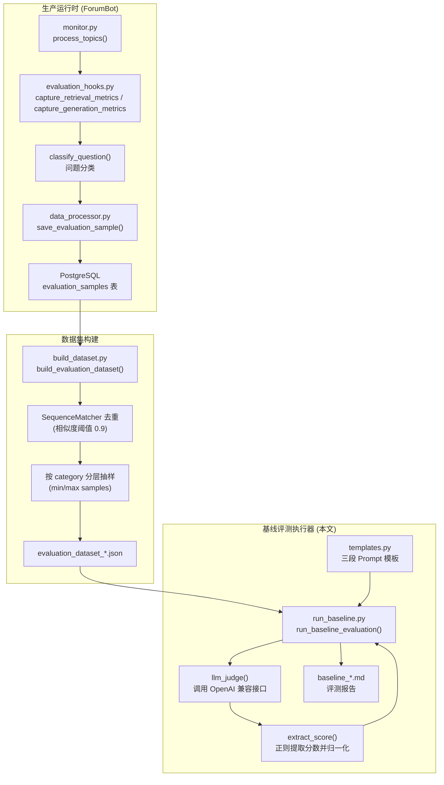

# LLM 裁判评估：基线自动打分框架

## 一、项目定位与核心价值

在一个以 RAG（检索增强生成）为核心的论坛问答机器人系统中，"回答得好不好"从来不是一个可以靠人眼抽查长期维系的判断。系统每天都会产生大量的检索上下文（retrieval_context）与生成回答（actual_output），如果没有一套自动化、可重复、可量化的评测机制，团队就只能凭感觉判断模型升级、Prompt 调整或知识库更新是否真的带来了效果提升。`src/evaluation` 目录正是为了填补这个空白而存在的一套**轻量级、零额外重依赖的离线评估框架**，其设计哲学可以概括为一句话：**用同一个 LLM 扮演"裁判"角色，对生产环境中沉淀下来的真实样本做三维度打分，产出可归档、可对比的 Markdown 报告**。

这套框架的核心价值体现在两个层面。第一是**数据闭环的完整性**：从 `monitor.py` 在处理每个论坛帖子时通过 `evaluation_hooks.py` 的装饰器无侵入式采集检索延迟、生成延迟、检索上下文和最终回答，到 `data_processor.py` 将这些字段落库进 PostgreSQL 的 `evaluation_samples` 表，再到 `build_dataset.py` 从数据库中按时间窗口、去重、按类别配额抽样构建评测集，最后由 `run_baseline.py` 消费该数据集完成打分——整条链路形成了"生产采集 → 数据集构建 → 离线评测"的完整闭环，避免了评测数据与生产流量脱节的问题。第二是**评测方法的务实取舍**：框架没有引入 DeepEval、RAGAS 等重量级评测框架及其依赖链，而是直接复用系统已有的 `OpenAI` 兼容客户端，用三段精心设计的中文 Prompt 模板驱动同一个业务 LLM 完成打分，这种"轻量方案"在工程成本和评测有效性之间取得了务实的平衡，尤其适合中小团队在没有专职评测基础设施的情况下快速建立回归基线。

Sources: [run_baseline.py](src/evaluation/run_baseline.py#L1-L235), [templates.py](src/evaluation/templates.py#L1-L38), [build_dataset.py](src/evaluation/build_dataset.py#L1-L143)

## 二、架构设计与模块划分

整个离线评估体系跨越了三个物理位置：生产运行时的采集钩子（`ForumBot` 包）、评估数据集构建（`build_dataset.py`）、以及本文重点剖析的基线打分执行器（`run_baseline.py` + `templates.py`）。下图完整呈现了这条数据从产生到评分报告落地的全链路。



**生产采集层**：`evaluation_hooks.py` 中的 `capture_retrieval_metrics` 与 `capture_generation_metrics` 是两个函数装饰器，通过 `threading.local()` 实现的 `_evaluation_context` 在检索函数与生成函数执行前后透明记录耗时与产出，不侵入业务逻辑本身。`classify_question()` 基于关键词规则（技术问题/使用问题/社区规则/其他）对问题做粗粒度分类，这个分类标签会一路传递到最终报告的"分类别统计"章节。

Sources: [evaluation_hooks.py](src/ForumBot/evaluation_hooks.py#L1-L67), [monitor.py](src/ForumBot/monitor.py#L393-L413)

**持久化层**：`data_processor.py` 中的 `save_evaluation_sample()` 将 `topic_id`、`input`、`retrieval_context`（JSONB）、`actual_output`、检索/生成延迟、token 消耗和分类一并写入 `evaluation_samples` 表，并在建表语句中为 `created_at` 和 `category` 建立了索引，这直接服务于后续 `build_dataset.py` 按时间窗口过滤和按类别聚合的查询模式。

Sources: [data_processor.py](src/ForumBot/data_processor.py#L688-L712), [data_processor.py](src/ForumBot/data_processor.py#L1216-L1265)

**数据集构建层**：`build_dataset.py` 从数据库拉取最近 N 天的样本后，用 `difflib.SequenceMatcher` 做逐条相似度比对去重（默认阈值 0.9），再对每个类别做分层抽样，样本量低于 `min_samples_per_category` 的类别全量保留，超过 `max_samples_per_category` 的类别用 `random.sample` 截断，最终写出带时间戳的 JSON 数据集文件。这一层不属于本文的直接溯源范围，但它是 `run_baseline.py` 输入契约的直接生产者，理解其字段结构（`input`、`retrieval_context`、`actual_output`、`category`）对读懂基线评测的输入假设至关重要。

Sources: [build_dataset.py](src/evaluation/build_dataset.py#L14-L122)

**基线评测执行层**：这正是 `run_baseline.py` 与 `templates.py` 所承担的职责，也是本文的核心剖析对象，将在下一节详细展开。

## 三、技术栈与核心工作流

### 3.1 三段式裁判 Prompt：`templates.py`

`templates.py` 没有使用任何 Prompt 工程框架，而是以纯 Python 字符串常量的形式定义了三个评测维度对应的模板，每个模板都遵循统一的结构范式：**角色（Role）→ 背景（Background）→ 目标（Goals）→ 输出格式约束（OutputFormat）**，并在末尾强制要求"仅输出一个数字（0-1），无其他内容"，这是为了让下游 `extract_score()` 能用简单的正则稳定解析出评分，避免 LLM 输出自然语言解释导致解析失败。

| 模板常量 | 评测维度 | 核心问题 | 占位字段 |
|---|---|---|---|
| `ANSWER_RELEVANCY_TEMPLATE` | 答案相关性 | 回答是否直接回应了用户问题 | `{input}`, `{actual_output}` |
| `FAITHFULNESS_TEMPLATE` | 忠实性 | 回答是否忠实于检索上下文，有无编造 | `{actual_output}`, `{retrieval_context}` |
| `CONTEXT_PRECISION_TEMPLATE` | 上下文精确率 | 检索到的每个 chunk 是否对回答问题有用 | `{retrieval_context}`, `{input}` |

这三个维度恰好对应经典 RAG 评测体系中最核心的三个正交指标：**生成质量**（相关性）、**生成可信度**（忠实性）、**检索质量**（精确率），分别从"答得对不对"、"答得有没有胡编"、"检索有没有找对材料"三个角度切入，覆盖了 RAG 系统故障归因所需的最基本信息，能帮助工程师判断问题出在检索环节还是生成环节。

> 设计哲学：把评测 Prompt 与打分逻辑彻底解耦为独立模块，使得后续新增评测维度（例如答案完整性、语气合规性）只需在 `templates.py` 追加一个模板常量，再在 `run_baseline.py` 中补一段调用逻辑，不需要改动报告生成和统计聚合的既有代码路径。

Sources: [templates.py](src/evaluation/templates.py#L1-L38)

### 3.2 主链路：`run_baseline_evaluation()` 执行流程

`run_baseline.py` 的主函数 `run_baseline_evaluation()` 是整个基线评测的入口，其执行链路可以概括为：**加载配置 → 初始化 LLM 客户端 → 读取数据集 → 逐样本三维打分 → 按类别聚合 → 生成 Markdown 报告**。

| 步骤 | 关键代码 | 作用 |
|---|---|---|
| 配置加载 | `load_config(config_path)` | 从 `config/config.yaml` 读取 `api` 段，取出 `model_name`、`base_url`、`api_key` |
| 客户端初始化 | `OpenAI(api_key=..., base_url=...)` | 复用系统统一的 OpenAI 兼容 SDK，与生产链路使用同一套调用方式 |
| 数据集读取 | `json.load(f)` | 直接消费 `build_dataset.py` 产出的 JSON 数组 |
| 上下文归一化 | `normalize_retrieval_context()` | 兼容 dict/str/list 三种历史存储形态，统一转为字符串列表 |
| 逐维度打分 | `llm_judge(client, model, prompt)` | 对每条样本分别调用三个模板生成的 Prompt，拿到三个独立分数 |
| 类别聚合 | `category_scores` 字典 | 按 `classify_question()` 打的标签分组累积三个维度的分数列表 |
| 报告落盘 | 拼接 Markdown 字符串写入 `baseline_{timestamp}.md` | 生成含总体指标、分类别统计、低分案例的报告文件 |

其中最值得关注的两个函数是 `extract_score()` 和 `llm_judge()`。`extract_score()` 用正则 `r'(\d+\.?\d*)'` 从 LLM 返回文本中抠出第一个数字，如果数字大于 1（说明 LLM 没有严格遵守"0-1 打分"的指令，可能输出了 0-10 的分制），就自动除以 10 做归一化，再用 `max(0.0, min(1.0, score))` 做兜底裁剪，异常或无法解析时返回保守中值 `0.5`。这种"宽容式解析 + 兜底默认值"的做法，体现了框架在对抗 LLM 输出不确定性时的工程实践：**不因单次解析失败中断整批评测，而是用中性分值占位，保证报告始终能生成**。

```python
def extract_score(response_text):
    try:
        match = re.search(r'(\d+\.?\d*)', response_text)
        if match:
            score = float(match.group(1))
            if score > 1.0:
                score = score / 10.0
            return max(0.0, min(1.0, score))
    except Exception:
        pass
    return 0.5
```

`llm_judge()` 则是对 LLM 调用的统一封装，固定 `temperature=0.1`（追求打分的低随机性和可重复性）与 `max_tokens=50`（因为期望输出仅是一个数字，无需为长文本预留空间），调用失败时打印错误并返回 `None`，交由上层逻辑决定是否将该分数计入统计。

Sources: [run_baseline.py](src/evaluation/run_baseline.py#L18-L52)

### 3.3 输入契约的兼容性处理

生产链路中 `retrieval_context` 字段在不同历史阶段可能以 dict（chunk_id → 内容）、纯字符串或列表三种形态落库，`normalize_retrieval_context()` 针对这三种情况分别做了兼容转换，这与 `data_processor.py` 中 `_normalize_retrieval_context()` 的处理逻辑是对称的，说明这套系统在设计上对"检索上下文"这个核心字段的多态存储有清晰的共识，评估侧和生产侧各自独立实现了归一化，但语义完全一致。

```python
def normalize_retrieval_context(retrieval_context):
    if isinstance(retrieval_context, dict):
        return [str(v) for v in retrieval_context.values()]
    elif isinstance(retrieval_context, str):
        return [retrieval_context] if retrieval_context else []
    elif isinstance(retrieval_context, list):
        return [str(item) for item in retrieval_context]
    return []
```

Sources: [run_baseline.py](src/evaluation/run_baseline.py#L45-L52), [data_processor.py](src/ForumBot/data_processor.py#L1206-L1214)

### 3.4 报告结构与统计口径

生成的 Markdown 报告以 `baseline_{YYYYMMDD_HHMMSS}.md` 命名落盘在 `evaluation_reports` 目录，结构上分为五个部分：报告元信息（评测时间/数据集路径/样本总数/模型/方法说明）、三个维度各自的**平均分 / 最低分 / 最高分 / 通过率**（统一以 `≥0.7` 作为及格阈值）、按 `category` 分组的三维度平均分、以及从前 10 条样本中筛选出的答案相关性低于 0.5 的**典型低分案例**（最多展示 3 条，截断输入文本至 200 字符）。这种报告结构的设计意图很明确：**既要有全局健康度的一眼概览，也要有可以直接定位问题样本的下钻明细**，方便工程师在版本迭代后快速判断"整体是否变好"以及"具体哪类问题在退化"。

需要指出一个实现细节：低分案例的筛选逻辑 `zip(dataset[:10], relevancy_scores[:10])` 只扫描数据集的前 10 条样本，而不是全量数据集，这是一种性能与报告简洁性之间的权衡，但也意味着如果低分案例集中分布在数据集靠后位置，报告可能无法捕捉到它们。这是当前实现的一个已知局限，在解读报告时需要留意。

Sources: [run_baseline.py](src/evaluation/run_baseline.py#L134-L220)

## 四、典型代码示例

以下是命令行直接运行基线评测的典型用法，对应 `run_baseline.py` 的 CLI 入口定义：

```python
if __name__ == '__main__':
    parser = argparse.ArgumentParser(description='运行LightRAG基线评测（轻量方案）')
    parser.add_argument('dataset_path', type=str, help='评估数据集路径')
    parser.add_argument('--config', type=str, default='config/config.yaml', help='配置文件路径')
    parser.add_argument('--output_dir', type=str, default='evaluation_reports', help='报告输出目录')

    args = parser.parse_args()

    run_baseline_evaluation(
        dataset_path=args.dataset_path,
        config_path=args.config,
        output_dir=args.output_dir
    )
```

实际调用形式为：

```bash
python src/evaluation/run_baseline.py evaluation_datasets/evaluation_dataset_20240101_120000.json \
    --config config/config.yaml \
    --output_dir evaluation_reports
```

其中 `dataset_path` 是必填的位置参数，通常直接取自 `build_dataset.py` 的产出文件；`--config` 决定了裁判 LLM 使用哪个模型和 API 端点（默认与生产回复所用的同一个 `Qwen/Qwen3-235B-A22B-Instruct-2507` 模型，通过 `config/config.yaml` 的 `api` 段配置），这意味着**当前实现是"用同一个模型评价自己"**，这在评测理论上存在一定的自我评价偏差风险，如果要追求更严谨的评测独立性，可以考虑为评测流程单独配置一个不同的裁判模型。

Sources: [run_baseline.py](src/evaluation/run_baseline.py#L223-L235), [config.yaml](config/config.yaml#L1-L6)

## 五、学习与探索建议

| 学习阶段 | 建议阅读内容 | 关注点 |
|---|---|---|
| 入门 | [templates.py](src/evaluation/templates.py) | 理解三个评测维度的 Prompt 设计范式，尝试自己新增一个评测维度模板 |
| 入门 | [run_baseline.py](src/evaluation/run_baseline.py) 的 `extract_score` / `llm_judge` | 理解如何用正则从自由文本 LLM 输出中稳定提取结构化分数 |
| 进阶 | [build_dataset.py](src/evaluation/build_dataset.py) | 理解评测数据集如何从生产数据去重、分层抽样构建而来 |
| 进阶 | [evaluation_hooks.py](src/ForumBot/evaluation_hooks.py) 与 [monitor.py](src/ForumBot/monitor.py#L393-L536) | 理解生产链路如何用装饰器无侵入采集检索/生成的中间产物 |
| 进阶 | [data_processor.py](src/ForumBot/data_processor.py#L1216-L1265) | 理解评估样本落库的表结构设计与字段归一化处理 |
| 深入 | 结合[可观测性与监控](.)章节的 Prometheus 指标文档 | 对比在线实时指标（Prometheus）与离线批量评测（本文）两套评测体系的互补关系 |

## 🔗 关联模块与上下游

- **上游数据生产者**：[monitor.py](src/ForumBot/monitor.py#L393-L536) 通过 `save_evaluation_sample()` 将每次问答处理的检索/生成产物写入 `evaluation_samples` 表，是本模块评测数据的原始来源。
- **上游数据集构建器**：[build_dataset.py](src/evaluation/build_dataset.py) 从数据库拉取、去重、抽样，产出本模块直接消费的 JSON 数据集文件，二者构成"构建-评测"的紧耦合流水线。
- **同级依赖**：[templates.py](src/evaluation/templates.py) 为 `run_baseline.py` 提供三段裁判 Prompt 模板，二者共同构成基线评测的完整实现，缺一不可。
