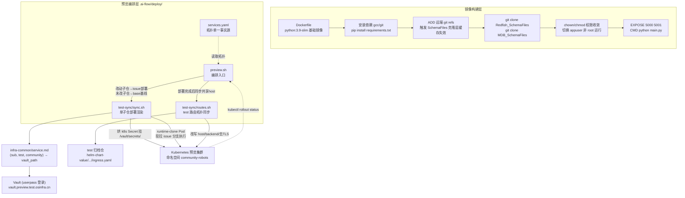

# Kubernetes 容器化部署与预览环境编排

## 1. 项目定位与核心价值

forum-reply-robot 作为一个长期在线运行的 Flask 服务（论坛监控 + LightRAG 检索增强 + 合规校验的机器人），面临的运维难题不是"如何打包"，而是"如何让每一个正在开发中的 Issue 分支都能在真实基础设施拓扑下被验证"。传统的做法是等代码合并到主干后才部署到测试环境，这意味着开发者要等到很晚才能发现"配置写错了""数据库连不上""Ingress 路由规则被 admission 拒绝"这类环境相关的问题。该仓库采用的方案是把**容器化构建**（Dockerfile）与**预览环境自动编排**（`.ai-flow/deploy/`）拆成两层解耦的关注点：前者负责把代码变成一个可复现、精简、安全加固的运行时镜像；后者负责在共享的 Kubernetes 预览集群里，按 Issue 粒度把该镜像（或直接克隆源码运行）编织进完整的服务拓扑——包括数据库底座、跨服务路由、Vault 配置注入——从而让每个 Issue 的预览环境无限接近生产的"test"环境形态。

这套编排体系的核心价值在于**归档单一事实源**与**可重复的自动化脚本链**。`services.yaml` 定义了本仓库在 umbrella 大仓中的服务拓扑坐标（端口、健康检查路径、数据库名、依赖关系），`preview.sh` 是编排入口，逐步完成命名空间准备、底座 PostgreSQL 复用式部署、变更子仓探测、单仓部署（`test-sync/sync.sh`）与路由拓扑同步（`test-sync/routes.sh`）。整套脚本由上游 `backlog` 仓库的 `gen-preview-hook.sh` 模板生成，意味着该项目的预览部署逻辑并非从零发明，而是复用了在 `meeting-server` 等仓库中已经"实测跑通"的范式，体现出该团队在多仓库治理中沉淀基础设施代码复用能力的设计哲学：**约定优先、模板生成、按需补全 TODO**。

Sources: [.ai-flow/deploy/README.md](.ai-flow/deploy/README.md#L1-L18), [.ai-flow/deploy/services.yaml](.ai-flow/deploy/services.yaml#L1-L41)

## 2. 架构设计与模块划分

整套部署体系可以清晰地划分为**镜像构建层**（Dockerfile）和**预览编排层**（`.ai-flow/deploy/`），后者又进一步细分为拓扑声明、部署入口、单仓同步与路由同步四个子模块。



**镜像构建层**：Dockerfile 采用官方 `python:3.9-slim` 作为基座，并在同一构建阶段内完成了大量安全收敛动作，例如显式创建非特权用户 `appuser`（UID/GID 1000）、设置 `umask 0027`、构建完成后主动删除 `gcc`/`cpp`/`ld` 等编译器和链接器二进制以缩小攻击面，同时清理 `dpkg` 相关触发器防止容器内被用来做包管理操作。这种"用完就删"的模式反映出该镜像的设计哲学是**纵深防御**：即使应用层出现远程代码执行漏洞，攻击者在容器内也难以借助编译工具链或包管理器进一步扩大影响面。

**Schema 文件的动态拉取机制**是该 Dockerfile 里一个值得关注的细节。项目依赖两个外部 Schema 仓库（`Redfish_SchemaFiles`、`MDB_SchemaFiles`）做合规校验规则，这些文件体量较大且更新频繁，因此没有直接 vendor 进代码仓库，而是在构建时用 `ADD <git-refs-url>` 这种"引用远端 refs 文件"的技巧，让 Docker 的层缓存机制感知到上游仓库 HEAD 是否变化——如果上游有新提交，这一层的缓存哈希就会变化，从而强制下一层的 `git clone` 重新执行，避免了传统写法里“克隆一次就永久缓存旧代码”的陷阱。

**预览编排层**是本页面的重点。`services.yaml` 作为拓扑声明文件，定义了 `subs`（本仓在 umbrella 内的服务标识，含端口 5000、健康检查路径 `/health`、数据库名 `forum_reply_robot`）、`foundation`（namespace 内共享一份的 PostgreSQL 底座配置）与 `test_archive`（测试环境路由归档仓库坐标，供 `routes.sh` 拉取真实 ingress 配置）。这个文件被显式标注为"由 `gen-preview-hook.sh` 从 `services/robot.yaml` 生成"，preview 相关字段自动填充，subs/foundation 部分需要人工按实测校准，体现出该体系"生成骨架 + 人工补全定制点"的半自动化策略。

Sources: [Dockerfile](Dockerfile#L1-L110), [.ai-flow/deploy/services.yaml](.ai-flow/deploy/services.yaml#L1-L41)

## 3. 技术栈与核心工作流

预览部署的执行主链路遵循「验权 → 建 ns → 底座 → 改动探测 → 单仓渲染部署 → 路由同步 → 网络诊断」的七段式流程，由 `preview.sh` 统一编排。这个入口脚本由上游 `backlog` 的 Workflow Develop 在 Issue 的 preview 阶段调用，其运行时环境变量（`WORK_DIR`/`UMBRELLA`/`ISSUE_NUMBER`/`BRANCH`/`KUBECONFIG`/`NAMESPACE` 等）全部来自调用方注入，脚本本身不假设任何硬编码的部署目标。

| 阶段 | 核心逻辑 | 关键实现 |
| --- | --- | --- |
| 验权 | 检查 `kubectl auth can-i create deployments -n $PREVIEW_NS`，避免临时 Service Account 权限不足时才在后续步骤报错 | preview.sh L24-L30 |
| 建命名空间 | `kubectl get ns` 判断存在性，不存在则 `kubectl create ns` | preview.sh L42-L46 |
| 底座 PostgreSQL | 首次部署时以 ConfigMap 挂载 `init.sql`（`CREATE DATABASE`）、Deployment（`strategy: Recreate`，单副本，`readinessProbe` 用 TCP 探活）、Service 三件套一次性 apply；已存在则直接复用，跨 Issue 共享 | preview.sh L48-L98 |
| 改动子仓探测 | 遍历 `.gitmodules` 列出的所有子仓（无 submodule 则退化为单体仓库 `.`），用 `git status --porcelain` 与 `git log origin/<default-branch>..HEAD` 判断该子仓相对主干是否有改动 | preview.sh L132-L144 |
| 差异化部署 | 改动子仓部署为 `<sub>-issue-<N>`（拉取 Issue 分支），未改子仓部署/复用 `<sub>-base`（主干基线，跨 Issue 共享，避免重复起无意义的 Pod） | preview.sh L146-L203 |
| 路由同步 | 若本轮有子仓改动，调用 `routes.sh` 把 test 环境的真实 ingress 拓扑改写成一个 Issue 共享的预览域名 | preview.sh L207-L221 |
| 网络诊断 | 收集 namespace 标签、`postgresql-service` Endpoints、NetworkPolicy、PeerAuthentication（Istio）等信息，专门用于排查 Pod 连底座数据库超时问题 | preview.sh L223-L229 |

`test-sync/sync.sh` 是单个子仓从"test 部署形态"转换为"预览部署形态"的核心渲染器。它先查询 `infra-common` 仓库的 `service.md` 表格，用 `(repo, test, community)` 三元组匹配出该服务在 test 环境的 Vault 路径；随后以 **userpass** 方式登录 Vault（不使用 Vault Agent Injector，因为预览集群没有为其配置对应的 Kubernetes Auth 角色），读出真实配置后在内存中改写数据库连接块（host 指向底座 Service 全限定域名、port 固定 5432、user 固定 postgres、password/database 替换为底座密码与库名）以及应用配置里的域名后缀（`.test.osinfra.cn` → `.preview.test.osinfra.cn`，但排除了 LightRAG 检索地址这类明确要求保持指向真实测试环境的例外域名）。改写完的内容被写成本地文件，再通过 `kubectl create secret generic --dry-run=client -o yaml | kubectl apply` 的幂等模式烘成 Kubernetes Secret，挂载到 `/vault/secrets/` 路径。

值得注意的是该脚本采用了**运行时克隆（runtime-clone）**而非预构建镜像的部署范式：Deployment 的容器直接使用裸的 `python:3.9-slim` 镜像，在 `command` 里现场执行 `git clone --depth 1 --branch <ref>`，其中 `<ref>` 的解析还处理了 `backlog` 平台的分支命名约定（真实开发分支形如 `issue-N-from-<base>`，脚本用 `git ls-remote --heads` 按前缀匹配找到真实分支名，找不到才回退到原始分支名直连）。这种设计避免了每次 Issue 迭代都要走完整的 CI 镜像构建流程，用"克隆源码 + 容器内 `pip install`"换取了预览环境更快的迭代速度，代价是启动时间变长（脚本里 `readinessProbe.initialDelaySeconds` 设到 600 秒、`failureThreshold` 60 次以容忍这一点）。

`test-sync/routes.sh` 则专注于路由拓扑的镶嵌：它从测试环境归档仓库拉取每个改动子仓对应的 `ingress.yaml`，用 Python + PyYAML 改写 `host` 为该 Issue 共享的域名（`forum-reply-robot-issue-<N>.<domain>`）、把 `backend.service.name` 指向预览部署名、剔除 `backend-protocol: HTTPS` 注解与 TLS 配置段（预览环境不做证书终止）、并对包含正则字符的 path 自动切换为 `pathType: ImplementationSpecific` 加 `use-regex: "true"` 注解——这是应对 Ingress-Nginx Admission Webhook 会拒绝在 `Prefix`/`Exact` 类型下写正则路径的已知坑。

Sources: [.ai-flow/deploy/preview.sh](.ai-flow/deploy/preview.sh#L1-L232), [.ai-flow/deploy/test-sync/sync.sh](.ai-flow/deploy/test-sync/sync.sh#L1-L260), [.ai-flow/deploy/test-sync/routes.sh](.ai-flow/deploy/test-sync/routes.sh#L1-L70)

## 4. 典型代码示例

**镜像的安全加固层**是理解该项目容器化策略的关键片段——它在同一批 RUN 指令里既做依赖安装，又立刻做工具链拆除，避免额外产生一层可回滚的镶嵌镜像层：

```dockerfile
# 创建普通用户（按照指定方式配置）
RUN groupadd -g 1000 appuser && \
    useradd -u 1000 -g appuser -s /sbin/nologin appuser

RUN chmod -R 750 /app && \
    chmod -R 700 /app/config && \
    chmod -R 600 /app/config/config.yaml && \
    chmod -R 700 /app/data && \
    ...
USER appuser
EXPOSE 5000 5001
CMD ["python", "main.py"]
```

Sources: [Dockerfile](Dockerfile#L12-L110)

**预览态 Deployment 的运行时克隆命令**展示了该体系不依赖 CI 镜像构建、而是让 Pod 自举拉取源码运行的核心机制：

```bash
REF="$(git ls-remote --heads "$CLONE_URL" "refs/heads/${BRANCH}-from-*" 2>/dev/null \
  | sed -E 's#.*refs/heads/##' | head -n 1 || true)"
[ -z "$REF" ] && REF="$BRANCH"
git clone --depth 1 --branch "$REF" "$CLONE_URL" /tmp/app
cd /tmp/app
cp /vault/secrets/config config/config.yaml
pip install --no-cache-dir -r requirements.txt
exec python main.py
```

Sources: [.ai-flow/deploy/test-sync/sync.sh](.ai-flow/deploy/test-sync/sync.sh#L184-L200)

**应用侧的三级健康检查体系**（`/startup`、`/health`、`/health/detail`）与 Kubernetes 的 startupProbe/readinessProbe 机制天然对应，其中详细检查端点还进一步汇报了 OIDC 与 LightRAG 检索服务的子组件配置状态：

```python
@app.route('/startup', methods=['GET'])
def startup_check():
    if service_initialized:
        return jsonify({"status": "ready", ...}), 200
    return jsonify({"status": "not_ready", ...}), 503

@app.route('/health', methods=['GET'])
def health_check():
    if service_initialized and monitor_instance and monitor_thread and monitor_thread.is_alive():
        return jsonify({"status": "healthy", ...}), 200
    return jsonify({"status": "unhealthy", ...}), 503
```

Sources: [main.py](main.py#L163-L196)

## 5. 排障心智模型与已知坑位

`.ai-flow/deploy/README.md` 沉淀了六个在实测中踩过的坑，这些坑本质上都源于"test 环境到预览环境的形态转换不是简单的字符串替换"这一事实：

| 坑位 | 现象 | 根因与修复 |
| --- | --- | --- |
| Vault 403 | login 返回 200 但 read 返回 403 | Vault policy 未授权读取 `internal/data/infra-test/<svc>`，需联系运维补权限 |
| 老 Pod 不更新 | Secret 内容变了但 Pod 挂载内容没刷新 | Secret 变化不会触发 Deployment 滚动，`apply` 是 no-op，必须显式 `kubectl rollout restart` |
| nginx 正则 path 被拒 | Ingress apply 失败或 404 | 含正则字符的 path 必须搭配 `pathType: ImplementationSpecific` + `nginx.ingress.kubernetes.io/use-regex: "true"` |
| DB 连不上 | 应用启动报连接错误 | host/port/user/password/database 五要素必须全套改写，只改 host 不够 |
| `/vault/secrets/config` 只读文件系统报错 | `OSError` | 该路径是只读 Secret 挂载，代码若尝试删除该文件会失败，需设置 `IS_DELETE_CONFIG=false` |
| 1049 Unknown database | 连接建立但选库失败 | `DB.NAME` 需按底座实际库名改写，注意连字符与下划线命名差异 |

这套排障对照表进一步给出了分层诊断顺序：Nginx 默认 404 页说明请求根本没到 Pod（先查 Ingress 是否成功创建）；HTTP 503 说明路由已建立但 Pod 未 Ready（查 `kubectl logs` 定位 CrashLoop 原因）；Django/Flask 框架自身的 404 页说明流量已经到达应用、只是该 path 未注册（属于正常情况）；若怀疑连不上底座数据库，则应按 Endpoints、NetworkPolicy、PeerAuthentication（Istio mTLS）的顺序逐层排查。

Sources: [.ai-flow/deploy/README.md](.ai-flow/deploy/README.md#L26-L47)

## 🔗 关联模块与上下游

- [.ai-flow/deploy/services.yaml](.ai-flow/deploy/services.yaml) — 拓扑单一事实源，`preview.sh`/`test-sync/*.sh` 均以此文件的 `subs`/`foundation`/`test_archive` 字段为输入参数，修改服务端口或健康检查路径需先改这里。
- [main.py](main.py#L163-L241) — 应用侧暴露的 `/startup`、`/health`、`/health/detail`、`/metrics` 端点，是 `services.yaml` 里 `health_endpoint` 字段及 Kubernetes Probe 配置的实际实现，两者必须保持一致。
- [.ai-flow/deploy/test-sync/sync.sh](.ai-flow/deploy/test-sync/sync.sh) 与 [.ai-flow/deploy/test-sync/routes.sh](.ai-flow/deploy/test-sync/routes.sh) — 分别负责单仓部署渲染与路由拓扑同步，二者由 `preview.sh` 按顺序调用，共享 `ROUTE_MAP`/`ING_DOMAIN` 等上下文变量，改动其中一个脚本的输出格式需同步核对另一个的解析逻辑。
