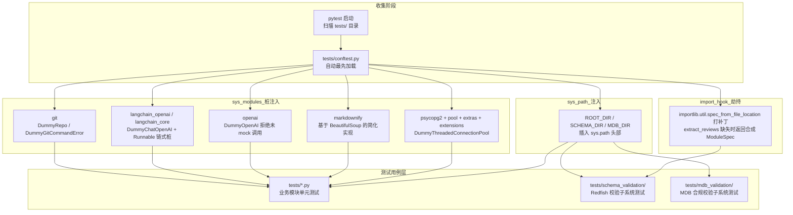

## 项目定位与核心价值

forum-reply-robot 是一个高度依赖外部系统的"胶水"服务：大模型 API、论坛 Discourse 接口、LightRAG 检索服务、GitCode 仓库、PostgreSQL 数据库——几乎每一个核心业务模块的每一次调用都要跨越进程边界。这类项目在测试时面临一个典型的两难：如果不做任何隔离，`pytest` 在 CI 环境中会因为缺少 `psycopg2`（需要编译原生扩展）、`git`（本地未装）、真实的 OpenAI/LangChain SDK 等依赖而直接在 import 阶段崩溃；如果为每个测试都手工搭建这些依赖的替身，测试代码会被大量重复的 mock 搭建逻辑污染，维护成本随测试数量线性增长。

`tests/conftest.py` 正是为解决这一矛盾而存在的**全局测试装置层**。它利用 pytest 的 conftest 机制——该文件在测试收集阶段自动被导入且仅导入一次——在所有测试模块加载之前，向 `sys.modules` 注入一整套"假"的第三方库实现。这种做法本质上是 Python 的 **import hook 劫持**：当业务代码执行 `import psycopg2` 时，Python 的导入系统会先检查 `sys.modules` 缓存，若已存在同名条目就直接复用，不会再触达真实的 `site-packages`。`conftest.py` 正是抓住了这一时机，在测试进程启动的最早阶段把缓存"占位"，从而让整个测试套件既不需要真实安装 `psycopg2`、`git`、`openai` 等重量级/编译型依赖，又能保证业务代码的 import 语句原封不动、无需为测试环境写任何 `try/except ImportError` 分支。

这一策略的核心价值在于**测试与生产环境代码的零侵入分离**：业务代码完全不知道自己是在测试环境中运行，`src/ForumBot/rate_limiter.py` 依然写着朴素的 `import psycopg2`，`src/update_lightrag/gitode_full_fetcher.py` 依然写着 `import git`。所有的隔离逻辑集中收敛在一个文件里，職責单一、易于审计，也避免了"测试专用代码路径"渗透进生产逻辑造成的维护负担。

Sources: [tests/conftest.py](tests/conftest.py), [pytest.ini](pytest.ini)

---

## 架构设计与模块划分

### 测试基础设施拓扑



### 核心层职责解析

**路径注入层（`sys.path` 补丁，`tests/conftest.py:9-15`）**

该项目的 `src/ForumBot/SchemaValidation/` 与 `src/ForumBot/MdbValidation/` 两个子包内部大量使用**基于文件路径的动态导入**（`importlib.util.spec_from_file_location`）而非标准的包相对导入，同时 `redfish_review_workflow.py` 内部又用 `sys.path.insert` 引用 `MdbValidation` 目录下的模块（如 `from mdb_classifier import is_mdb_related`）。这意味着测试进程必须让这两个子目录本身在 `sys.path` 中可见，否则 `mdb_classifier`、`mdb_checker` 等模块名会找不到。`conftest.py` 在收集阶段把 `ROOT_DIR`（仓库根目录）、`SCHEMA_DIR`、`MDB_DIR` 三个路径统一插入 `sys.path` 头部，一次性解决了子包间横向引用与仓库根导入（`from src.ForumBot... import ...`）两种导入形态的路径可见性问题。

**数据库驱动桩层（`psycopg2` 全家桶，`tests/conftest.py:18-67`）**

这是全文件中最复杂的一段桩代码，因为 `psycopg2` 不是一个扁平模块，而是一个带有 `pool`、`extras`、`extensions` 三个子模块的树状结构，业务代码（`src/utils.py`、`data_processor.py`）会分别用到：
- `psycopg2.connect()`、`psycopg2.OperationalError`、`psycopg2.Error`
- `psycopg2.pool.ThreadedConnectionPool`（连接池核心类）
- `psycopg2.extras.register_default_jsonb` / `Json`（JSONB 类型适配）
- `psycopg2.extensions.register_adapter`（dict → JSON 适配器注册）

`conftest.py` 逐一为这四个层级构造 `types.ModuleType` 实例并挂载同名属性，其中 `DummyThreadedConnectionPool` 完整还原了真实连接池的四个核心方法签名（`__init__(minconn, maxconn, **kwargs)`、`getconn`、`putconn`、`closeall`），使得依赖连接池状态机的测试（如 `TestDBConnectionPool`）可以直接 `@patch('psycopg2.pool.ThreadedConnectionPool')` 来注入自己的 `Mock`，而不会在 patch 目标不存在时报 `AttributeError`。

**HTML 转换桩层（`markdownify`，`tests/conftest.py:70-89`）**

`markdownify` 库在生产环境用于把论坛帖子的 HTML 内容转成 Markdown 喂给大模型。`conftest.py` 没有简单地返回空字符串占位，而是基于项目已经依赖的 `BeautifulSoup` **重新实现了一个简化但语义正确**的转换器（处理 `<br>`、`<strong>/<b>`、`<h1>~<h6>`、`<p>` 标签），这样依赖 HTML→Markdown 转换结果做断言的测试（`data_processor.py` 相关测试）依然能拿到有意义的输出，而不是被一个纯粹的空壳骗过去。这体现了"桩不等于空壳"的设计原则：桩要在不引入真实网络/编译依赖的前提下尽量还原真实行为。

**LLM SDK 拒绝式桩层（`openai` / `langchain_openai` / `langchain_core`，`tests/conftest.py:92-197`）**

这三个模块的桩实现采用了**"默认拒绝、显式 mock"**的策略。`DummyOpenAI.chat.completions.create` 与 `DummyChatOpenAI.invoke` 都不返回任何伪造数据，而是直接抛出 `RuntimeError("... should be mocked in tests")`。这是一种防御性的测试纪律：任何测试如果忘记显式 `@patch` 大模型调用点，就会在断言阶段之前就因为这个 `RuntimeError` 而失败，而不是悄悄返回一个无意义的默认值让测试"假性通过"。`langchain_core` 的桩甚至还原了 `ChatPromptTemplate | ChatOpenAI | StrOutputParser` 这种 LangChain 招牌式的管道操作符（`__or__`），通过 `_DummyRunnable` 类模拟 `Runnable.invoke()` 链式调用语义，让依赖 LCEL（LangChain Expression Language）风格代码的模块也能被正确导入。

**Git 客户端桩层（`git`，`tests/conftest.py:202-218`）**

`src/update_lightrag/gitode_full_fetcher.py` 使用 `GitPython` 的 `Repo` 类做仓库克隆/拉取。桩实现的 `DummyRepo` 提供了 `remotes.origin.pull` 的属性链路径和 `clone_from` 静态方法，其余测试通过 `@patch('src.update_lightrag.gitode_full_fetcher.git.Repo')` 在此基础上进一步注入具体的返回值/异常，`conftest.py` 里的桩只负责保证模块能被 import，具体行为由各测试自行定制。

**动态导入劫持层（`_patched_spec_from_file_location`，`tests/conftest.py:221-254`）**

这是最精巧的一段代码，用于解决一个特殊的循环依赖式测试问题。`src/ForumBot/SchemaValidation/end_to_end_check.py` 在模块级用 `importlib.util.spec_from_file_location("extract_reviews", ...)` 动态加载同目录下的 `extract_reviews.py` 文件——这是模块级代码，意味着**只要 import `end_to_end_check`，这次动态加载就会立即执行**。当某些测试场景下目标文件路径不存在或需要被隔离替换时，直接 mock `spec_from_file_location` 的返回值很困难，因为它是在 import 语句执行期间被调用的，时机早于测试函数体。`conftest.py` 因此选择了更底层的手段：整体替换 `importlib.util.spec_from_file_location` 函数本身（保存原函数引用 `_ORIGINAL_SPEC_FROM_FILE_LOCATION` 以便正常路径回退），当检测到请求的是 `name == "extract_reviews"` 且目标文件路径不存在时，返回一个自定义 `ModuleSpec`，其 `loader` 是实现了 `importlib.abc.Loader` 接口的 `_ExtractReviewsLoader`，在 `exec_module` 中直接向 module 对象注入三个返回空结果的桩函数（`extract_review_points_from_html`、`extract_all_review_points`、`is_redfish_related`）。这是一种"import 系统级 Mock"，比常规的 `unittest.mock.patch` 更底层，专门用于处理模块加载时机早于测试 fixture 生效时机的边界情况。

Sources: [tests/conftest.py](tests/conftest.py#L1-L254), [src/ForumBot/SchemaValidation/end_to_end_check.py](src/ForumBot/SchemaValidation/end_to_end_check.py#L181-L208), [src/ForumBot/SchemaValidation/redfish_review_workflow.py](src/ForumBot/SchemaValidation/redfish_review_workflow.py#L36)

---

## 技术栈与核心工作流

### pytest 配置与插件规避

`pytest.ini` 中只有一条非默认配置——`addopts = -p no:asyncio`——但其背后的原因值得展开。项目锁定 `pytest==7.4.4`（见 `requirements-test.txt`），而某些共享 CI 镜像会全局预装 `pytest-asyncio>=0.24`，该版本在插件初始化时会执行 `from pytest import FixtureDef`，但 `FixtureDef` 只在 pytest 8.x 才被提升为公共 API，在 7.4.4 环境下这一 import 直接失败，导致 pytest **启动阶段**就崩溃（比任何测试用例执行都更早），进而使覆盖率报告 `coverage.xml` 无法生成，CI 流水线整体失败。由于本项目不使用任何异步测试（`monitor.py` 的轮询循环、大模型调用均是同步阻塞式的），`-p no:asyncio` 直接禁用该插件的自动加载，是一种精准打击式的环境兼容修复，且明确注明"无需改动共享 CI 脚本"，体现了在不可控的共享基础设施约束下寻找局部可控解法的工程务实态度。

### 测试目录的三层结构

| 目录 | 覆盖范围 | 典型隔离手段 |
| --- | --- | --- |
| `tests/*.py`（根级，约 30 个文件） | `src/ForumBot/`、`src/update_lightrag/`、`src/evaluation/`、`main.py` 的单元测试 | `@patch` 装饰器 + fixture 注入的 config 字典 |
| `tests/schema_validation/` | Redfish Schema 校验子系统（`end_to_end_check`、`redfish_checker`、`redfish_schema_validator`、`redfish_uri_generator` 等） | `monkeypatch.setattr` 替换 `Config` 类属性、`_call_llm` 等方法级 mock |
| `tests/mdb_validation/` | MDB 合规校验子系统（`mdb_checker`、`mdb_classifier`）及其与 `end_to_end_check` 的集成路径 | `@patch.object(MdbComplianceChecker, '_call_llm')` 精确打击 LLM 调用点，规则加载走真实 JSON 文件 |

三层结构与 `src/ForumBot/` 下的子包划分严格对应，测试文件的组织方式直接映射了业务代码的模块边界，降低了"找测试"的认知成本——修改 `redfish_uri_generator.py` 时开发者能立刻定位到 `tests/schema_validation/test_redfish_uri_generator.py`。

### 两种 Mock 注入范式的分工

该项目在具体测试用例层面并存两种主流的 mock 注入方式，`conftest.py` 处理的是"进程级、一次性"的依赖替身，而测试函数内部处理的是"用例级、按需"的行为定制：

| 范式 | 作用层级 | 典型场景 | 示例 |
| --- | --- | --- | --- |
| `sys.modules` 全局桩注入 | 进程级，测试收集阶段生效一次 | 缺失/重量级第三方库（`psycopg2`、`git`、`openai`） | `tests/conftest.py:18-218` |
| `@unittest.mock.patch` 装饰器 | 用例级，仅在被装饰函数执行期间生效 | 替换具体函数/方法的返回值或副作用，如 `requests.get`、`psycopg2.pool.ThreadedConnectionPool` | `tests/test_gitcode_client.py:54`，`tests/test_utils.py:268` |
| `pytest monkeypatch` fixture | 用例级，自动在测试结束后还原 | 替换模块内部函数引用（如 `fetch_all_forum_topics`）、临时注入 `sys.modules` 条目 | `tests/test_forum_client_pre_audit.py:21`，`tests/test_main_schema_files.py:14` |
| `patch.object` 精确打击实例方法 | 用例级，避免误伤同名函数的其他调用路径 | `MdbComplianceChecker._call_llm`、`GitCodeAPIIncrementFetcher.__init__` | `tests/mdb_validation/test_mdb_checker.py:601`，`tests/test_gitcode_api_increment_fetcher.py:58` |

值得关注的是 `tests/test_main_schema_files.py` 中的 `import_main_module` 辅助函数，它展示了一种更激进的**导入时依赖替换**手法：在真正 `import main` 之前，先用 `monkeypatch.setitem(sys.modules, ...)` 把 `main.py` 会间接 import 的 `ForumMonitor`、`FullDataUpdate`、`UpdateLightRAGTimer` 等重量级业务类替换成极简的动态生成类（`type(class_name, (), {...})`），以及连硬件相关的 `netifaces` 库也一并注入桩实现。这解决了 `main.py` 作为生产入口天然会在模块顶层实例化/连接大量重量级依赖的测试难题，让"仅测试 `main.py` 里的一个纯函数（如 `check_schema_files`）"这种诉求不必付出加载整条业务链路的代价。

Sources: [pytest.ini](pytest.ini), [requirements-test.txt](requirements-test.txt), [tests/test_main_schema_files.py](tests/test_main_schema_files.py#L1-L18), [tests/test_forum_client_pre_audit.py](tests/test_forum_client_pre_audit.py#L1-L36), [tests/mdb_validation/test_mdb_checker.py](tests/mdb_validation/test_mdb_checker.py#L601-L610)

---

## 典型代码示例

### 树状模块桩的构造范式（psycopg2）

```python
# tests/conftest.py — 为带子模块的第三方库构造完整桩树
if "psycopg2" not in sys.modules:
    psycopg2_module = types.ModuleType("psycopg2")
    psycopg2_module.connect = lambda **kwargs: None

    class DummyThreadedConnectionPool:
        def __init__(self, minconn, maxconn, **kwargs):
            self.minconn = minconn
            self.maxconn = maxconn

        def getconn(self):
            return None

        def putconn(self, conn):
            pass

        def closeall(self):
            pass

    psycopg2_pool_module = types.ModuleType("psycopg2.pool")
    psycopg2_pool_module.ThreadedConnectionPool = DummyThreadedConnectionPool
    psycopg2_module.pool = psycopg2_pool_module
    sys.modules["psycopg2"] = psycopg2_module
    sys.modules["psycopg2.pool"] = psycopg2_pool_module  # 子模块必须单独注册
```

这里有一个容易被忽视但至关重要的细节：`psycopg2.pool` 子模块不仅要挂载到父模块的 `pool` 属性上，还**必须**单独以 `"psycopg2.pool"` 为 key 注册进 `sys.modules`。这是因为 Python 的 `import psycopg2.pool` 或 `from psycopg2 import pool` 语句会分别检查 `sys.modules["psycopg2.pool"]` 这一独立缓存项，仅设置父模块属性无法满足所有导入语法形式。

Sources: [tests/conftest.py](tests/conftest.py#L18-L67)

### import 系统级劫持（extract_reviews 合成模块）

```python
# tests/conftest.py — 劫持 spec_from_file_location 而非常规 patch
class _ExtractReviewsLoader(importlib.abc.Loader):
    def create_module(self, spec):
        return None

    def exec_module(self, module):
        module.extract_review_points_from_html = lambda content: []
        module.extract_all_review_points = lambda content: []
        module.is_redfish_related = lambda title, content: False


_ORIGINAL_SPEC_FROM_FILE_LOCATION = importlib.util.spec_from_file_location

def _patched_spec_from_file_location(name, location, *args, **kwargs):
    if name == "extract_reviews" and location and not os.path.exists(location):
        return importlib.machinery.ModuleSpec(
            name=name, loader=_ExtractReviewsLoader(),
            origin="synthetic://extract_reviews",
        )
    return _ORIGINAL_SPEC_FROM_FILE_LOCATION(name, location, *args, **kwargs)

importlib.util.spec_from_file_location = _patched_spec_from_file_location
```

这段代码的判断条件 `not os.path.exists(location)` 意味着它只在目标文件真的缺失时才启用合成模块，正常开发环境下 `extract_reviews.py` 文件存在，补丁会透明地委托给原始实现，不影响真实校验逻辑的测试。这是一种"故障降级式"补丁，而非"强制替换式"补丁。

Sources: [tests/conftest.py](tests/conftest.py#L221-L254)

---

## 测试隔离策略的取舍与边界

> 该项目的隔离哲学是"在 import 边界做重量级替换，在函数边界做行为级替换"——前者解决能不能跑起来的问题，后者解决断言是否符合预期的问题。

需要指出的是，这种进程级全局桩注入策略存在一个隐含约束：`conftest.py` 中所有的 `if "xxx" not in sys.modules` 判断都是**幂等但非线程安全**的一次性初始化，这在单进程串行执行的 pytest 默认模式下没有问题，但如果未来引入 `pytest-xdist` 等并行测试插件并且多进程共享同一份 `sys.modules` 状态假设，需要重新审视该文件的并发安全性（目前项目并未使用并行测试插件，`pytest.ini` 也刻意屏蔽了 `pytest-asyncio`，说明测试基础设施整体还处于同步单进程的设计假设之内）。

另外，`markdownify` 桩的"尽量还原真实行为"与 `openai`/`langchain` 桩的"默认拒绝"是两种相反的设计取向，选择依据是**该依赖的输出是否会被测试断言直接消费**：HTML→Markdown 转换结果经常被拿来做字符串包含断言，因此值得投入实现精力；而 LLM 调用的返回值几乎在每个测试里都需要按用例定制不同的答案，桩本身返回任何固定值都没有意义，不如直接报错逼迫用例显式 mock。

Sources: [tests/conftest.py](tests/conftest.py#L1-L254)

---

## 学习与探索建议

| 阶段 | 建议路径 | 关注点 |
| --- | --- | --- |
| 入门 | 先读 `tests/test_logging_config.py`、`tests/test_update_time.py` 等轻量文件 | 理解不依赖 `conftest.py` 桩的"纯"单元测试写法作为基线 |
| 进阶 | 精读 `tests/conftest.py` 全文，配合 `src/utils.py` 连接池实现对照阅读 | 理解 `sys.modules` 桩注入如何与 `@patch('psycopg2.pool.ThreadedConnectionPool')` 配合工作 |
| 进阶 | 阅读 `tests/test_main_schema_files.py` 的 `import_main_module` | 理解"导入时依赖替换"手法，为测试其他重量级入口模块（如新增的 worker 脚本）提供模板 |
| 深入 | 对照 `src/ForumBot/SchemaValidation/end_to_end_check.py:181-208` 与 `conftest.py:221-254` | 理解动态文件路径导入（`spec_from_file_location`）与常规包导入混用时的测试隔离难点 |
| 实战 | 新增外部依赖（新的 SDK/客户端库）时 | 先判断该依赖的返回值是否会被断言消费：会消费则参考 `markdownify` 桩投入实现精力，纯粹是通道则参考 `openai` 桩走"默认拒绝" |

## 🔗 关联模块与上下游

- [src/utils.py](src/utils.py) — `TestDBConnectionPool` 系列测试直接依赖 `conftest.py` 注入的 `DummyThreadedConnectionPool`，两者需配合阅读才能理解连接池状态机测试的完整链路
- [src/ForumBot/SchemaValidation/end_to_end_check.py](src/ForumBot/SchemaValidation/end_to_end_check.py#L181-L208) — 模块级动态导入触发点，是 `conftest.py` 中 `_patched_spec_from_file_location` 补丁存在的直接原因
- [pytest.ini](pytest.ini) — 与 `conftest.py` 共同构成测试运行时环境的两大配置入口，前者管插件加载，后者管依赖桩注入
