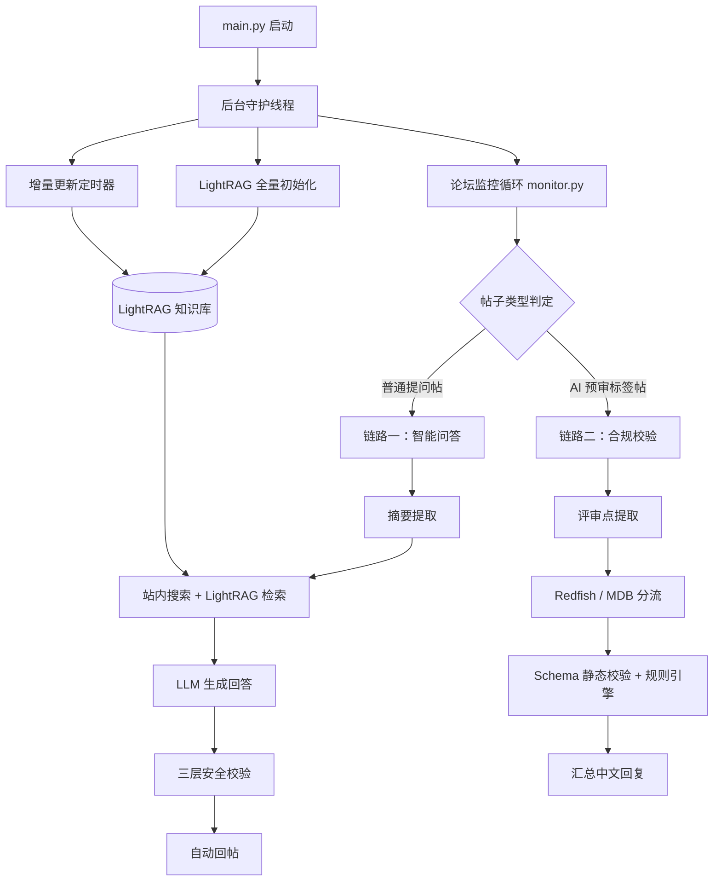
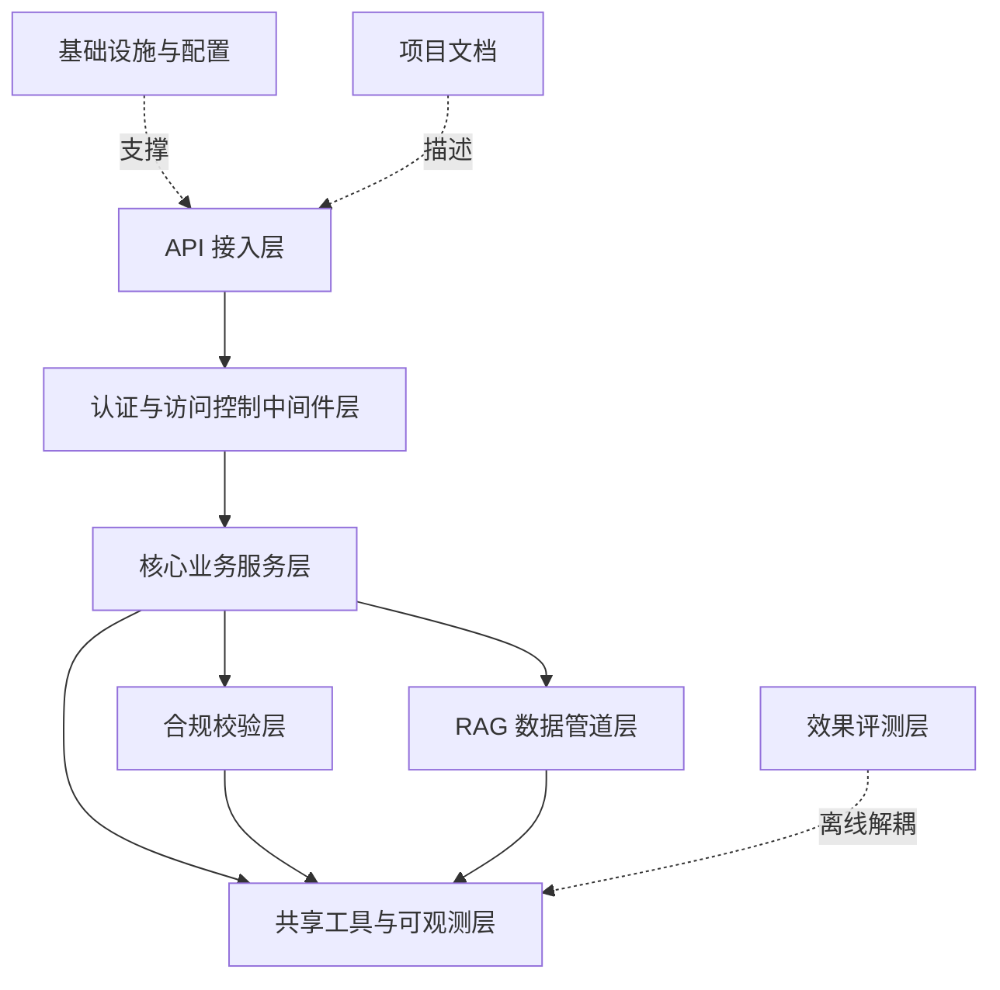

# forum-reply-robot 新人上手指南

> 本指南由知识图谱（`.ua/knowledge-graph.json`）自动生成。
> 图谱构建于 commit `c9a96c0a71dfb12d9c096167de272b550d1d7563`，覆盖 225 个节点、493 条边、9 个架构层。
>
> **两点重要说明**
> 1. 本次分析**排除了 `tests/` 目录**，因此下文的文件地图与架构层中看不到任何测试文件。这不代表项目没有测试——`tests/` 下实际有 **47 个 Python 测试文件**，运行方式见 `README.md` 与 `pytest.ini`。
> 2. 生成时工作区中 `CLAUDE.md` 有未提交修改，该文件的最新改动可能未反映在本指南中。若发现描述与实际不符，重新运行 `/understand` 刷新图谱。

---

## 1. 项目概览

| 项目 | 内容 |
| --- | --- |
| 名称 | forum-reply-robot |
| 主要语言 | Python（辅以 YAML、JSON、Markdown、Dockerfile） |
| 核心框架 | Flask、LangChain、OpenAI SDK、pandas、psycopg2、Prometheus、Authlib、schedule、BeautifulSoup、Docker、pytest |

自动监控论坛新帖并调用大模型智能回复的机器人服务。它轮询论坛发现新帖，经摘要提取、站内搜索与 LightRAG 知识库检索后调用 LLM 生成回答并自动回帖；同时对预审标签帖执行 Redfish Schema 与 MDB 规则的结构化合规校验。

服务有两条核心业务链路，理解它们是理解整个代码库的前提：

---

## 2. 架构层

项目被划分为 9 层，自上而下大致对应「请求入口 → 安全 → 业务 → 数据 → 基础设施」。

### API 接入层
基于 Flask 的应用工厂与 HTTP 入口，负责装配蓝图、暴露健康检查与 Prometheus 指标端点，并在后台线程中拉起论坛监控与 LightRAG 定时任务。
关键文件：`main.py`、`src/ForumBot/rag_api.py`、`src/ForumBot/standalone_api.py`

### 认证与访问控制中间件层
围绕 OIDC 的身份认证、RBAC 授权与基于数据库的限流中间件，为 API 接入层提供统一的请求前置校验与安全防护。
关键文件：`src/ForumBot/auth_middleware.py`、`src/ForumBot/oidc_client.py`、`src/ForumBot/rate_limiter.py`

### 核心业务服务层
论坛帖子监控调度、大模型回复生成与多模态图片增强的业务主干，由 monitor 编排 ai_processor、forum_client 与 image_processor 完成「发现新帖到智能回复」的闭环。
关键文件：`src/ForumBot/monitor.py`、`src/ForumBot/ai_processor.py`、`src/ForumBot/forum_client.py`

### 合规校验层
Redfish 与 MDB 两套规则引擎，结合 JSON Schema 静态校验和大模型辅助判定对评审内容做合规检查，规则集以外置 JSON 规则文件驱动并支持多版本共存。这是项目最大的子系统，共 15 个文件。
关键文件：`src/ForumBot/SchemaValidation/end_to_end_check.py`、`redfish_checker.py`、`src/ForumBot/MdbValidation/mdb_checker.py`

### RAG 数据管道层
面向 LightRAG 知识库的数据采集与同步管道，从论坛和 GitCode 抓取原始数据，经过滤与多模态富化后全量初始化或按时间戳增量更新入库。
关键文件：`src/update_lightrag/full_data_init.py`、`lightrag_client.py`、`increment_date_update_timer.py`

### 共享工具与可观测层
被全项目高频复用的横切基础能力，包括 PostgreSQL 连接池与配置加载、单例日志配置（fan-in 28，为全项目最高）、token 用量统计与 Prometheus 指标埋点。
关键文件：`src/utils.py`、`src/ForumBot/logging_config.py`、`src/ForumBot/data_processor.py`

### 效果评测层
离线评测工具链，从数据库采样构建评测集，以 LLM-as-judge 方式跑基线并输出指标报告，提示词模板集中在 templates 中维护。与线上服务完全解耦。
关键文件：`src/evaluation/build_dataset.py`、`run_baseline.py`、`templates.py`

### 基础设施与配置
多阶段构建的容器镜像定义、运行时 YAML 配置（大模型 API 凭据等）、pytest 配置以及分场景的依赖清单。
关键文件：`Dockerfile`、`config/config.yaml`、`pytest.ini`、`requirements*.txt`

### 项目文档
项目说明与架构上下文文档，覆盖快速上手、部署方式与面向 AI 协作的工程约定。
关键文件：`README.md`、`CLAUDE.md`

---

## 3. 核心概念与设计约定

**单进程多守护线程的进程模型。** `main.py` 是唯一启动点，论坛监控、LightRAG 全量初始化、增量更新定时器各占一个后台守护线程，主线程只保留健康检查与指标接口。看懂 `main() → check_schema_files() → load_config() → 守护线程` 这条链，就掌握了「服务起来之后有哪几条线在并行跑」。

**连接池集中管理，业务层只借还不创建。** PostgreSQL 全局连接池在 `src/utils.py` 中初始化，`data_processor.py`、`rate_limiter.py`、`schema_debug_logger.py` 等调用方一律从池中借还，不自行建连。

**日志与配置作为单一底座。** `logging_config.py` 是全图 fan-in 最高的节点（28 个模块 import 它），基于 `RotatingFileHandler` 提供 logger 工厂并导出全局 `main_logger`。`src/utils.py` 排第二（9 个）。先认识这两个模块能省下大量跳转。

**规则外置，代码不写判定标准。** Redfish 与 MDB 的合规判定口径全部放在 JSON 规则文件里（`redfish_compliance_rules.json` 17 条规则；`mdb_compliance_rules_v6.3.json` 45 条、`v6.5.json` 26 条），支持按版本切换加载。改规则不需要改代码。

**LLM 调用的三层把关是安全边界。** `ai_processor.py` 集中了提示词注入检测、答案相关性校验与质量校验，校验失败默认不回复。它不只是一个 LLM SDK 包装，而是承担安全职责的模块。

**成本优化：规则批量合并调用。** `redfish_checker.py` 把全部规则合并为一次 LLM 调用而非逐条调用，并配套静态类型预检、JSON 修复与结果补全来兜住模型输出的不确定性。

**路由默认叠加装饰器保护。** API 层每个路由都套 `auth_middleware`（Bearer token + OIDC userinfo 校验）与 `rate_limiter`（PostgreSQL 滑动窗口配额），`rbac_middleware` 额外控制知识库上传权限。

**可观测性为旁路埋点。** `prometheus_metrics.py`、`token_tracker.py`、`evaluation_hooks.py` 只做采集与上报，不参与任何业务判定。

---

## 4. 导览路线（14 步）

按顺序读，每一步都建立在上一步的基础上。

1. **项目概览** — `README.md`。27 个小节覆盖功能特性、进程模型、两条核心链路、快速开始与容器化部署。重点看进程模型描述，它是后续所有步骤的骨架。
2. **应用入口与运行配置** — `main.py`、`config/config.yaml`。唯一启动点 + 唯一运行时配置文件（大模型 base_url / api_key / model_name）。
3. **共享工具与日志基座** — `src/ForumBot/logging_config.py`、`src/utils.py`。全项目依赖的底座：logger 工厂与全局 `main_logger`、配置加载、PostgreSQL 连接池。
4. **论坛监控主循环** — `src/ForumBot/monitor.py`、`forum_client.py`。monitor 是编排者（fan-out 最高，连出 9 条依赖），forum_client 是它的外部世界接口。
5. **数据处理与持久化** — `src/ForumBot/data_processor.py`、`image_processor.py`。抓取主题内容、清洗 HTML 与图片链接、解析预审就绪状态，落库 PostgreSQL 并写 CSV。
6. **大模型调用与安全三层把关** — `src/ForumBot/ai_processor.py`、`llm_token_usage.py`。摘要、注入检测、相关性与质量校验，含多模型轮询与重试。`llm_token_usage.py` 在依赖链最深处（BFS depth 4）。
7. **合规校验层** — `SchemaValidation/end_to_end_check.py`、`redfish_checker.py`、`MdbValidation/mdb_checker.py` 及两份规则文件。链路二的主体：end_to_end_check 编排，两个 checker 分路判定。
8. **RAG 数据管道** — `update_lightrag/full_data_init.py`、`increment_date_update_timer.py`、`lightrag_client.py`、`filter.py`。知识的来源：启动时同步全量初始化 + schedule 驱动的每日增量。
9. **API 接入层** — `rag_api.py`、`standalone_api.py`、`api_main.py`、`external_api_app.py`。解释了为什么 `main.py` 之外还有多个「入口」（`external_api_app.py` 仅用于调试，生产已并入主应用）。
10. **认证与访问控制中间件** — `auth_middleware.py`、`oidc_client.py`、`rate_limiter.py`。第 9 步的每个路由都不是裸露的。
11. **可观测性埋点** — `prometheus_metrics.py`、`token_tracker.py`、`evaluation_hooks.py`。判断服务是否健康的依据。
12. **效果评测闭环** — `evaluation/build_dataset.py`、`run_baseline.py`、`templates.py`。第 11 步测「快不快」，这层测「答得好不好」。
13. **容器化与依赖管理** — `Dockerfile`、`requirements.txt`、`requirements-test.txt`。镜像会拉取第 7 步校验层需要的 Redfish/MDB Schema 仓库。
14. **回看全局：导航文档** — `CLAUDE.md`、`pytest.ini`。`CLAUDE.md` 是全图 fan-out 最高的节点（连出 10 条边），可当索引反查表。

---

## 5. 文件地图

按架构层组织。复杂度标注为 `简单` / `中等` / `复杂`。

### API 接入层

| 文件 | 复杂度 | 职责 |
| --- | --- | --- |
| `main.py` | 复杂 | 项目主入口：创建 Flask 应用，以后台线程启动论坛监控、LightRAG 全量初始化与增量更新定时器，并暴露健康检查与 Prometheus 指标接口 |
| `src/ForumBot/rag_api.py` | 复杂 | 对外 RAG API 控制器：以 Flask Blueprint 注册检索与文档状态查询路由，每个路由叠加认证 middleware 与限流装饰器 |
| `src/ForumBot/standalone_api.py` | 中等 | 独立 Flask API 服务工厂，暴露 `/health` 与 `/process_question`，内部复用论坛检索与大模型生成链路 |
| `src/external_api_app.py` | 中等 | 独立调试用的外部 API 应用工厂，装配配置加载、限流建表与 RAG API Blueprint；生产环境该能力已合并进主应用 |
| `src/ForumBot/api_main.py` | 简单 | 独立 API 服务的命令行入口，解析 host/port/config 参数后启动 standalone_api |
| `src/__init__.py` | 简单 | src 顶层包标记文件 |

### 认证与访问控制中间件层

| 文件 | 复杂度 | 职责 |
| --- | --- | --- |
| `src/ForumBot/oidc_client.py` | 复杂 | OIDC 客户端：封装授权码流程完整生命周期（state 生成校验、授权 URL 构造、code 换 token、token 刷新、id_token 解码、userinfo 校验） |
| `src/ForumBot/auth_middleware.py` | 中等 | 从请求头提取 Bearer token，通过 OIDC userinfo 端点校验有效性，以装饰器形式保护 API 路由 |
| `src/ForumBot/rate_limiter.py` | 中等 | 基于 PostgreSQL 计数器的用户级滑动窗口限流器，提供建表函数与路由装饰器 |
| `src/ForumBot/rbac_middleware.py` | 简单 | 基于 user_id 白名单控制知识库上传权限 |

### 核心业务服务层

| 文件 | 复杂度 | 职责 |
| --- | --- | --- |
| `src/ForumBot/monitor.py` | 复杂 | 论坛监控主循环：轮询新帖与预审帖，串联检索、大模型生成、质量校验与自动回复，并同步 CSV 到 Git 仓库 |
| `src/ForumBot/ai_processor.py` | 复杂 | 大模型调用处理器：文本摘要、提示注入检测、答案相关性与质量校验，内置多模型轮询与重试 |
| `src/ForumBot/forum_client.py` | 中等 | 论坛 HTTP 客户端：拉取主题详情、发布回复、检索相关主题与 LightRAG 文档召回 |
| `src/ForumBot/image_processor.py` | 中等 | 从文本提取图片链接，调用多模态模型生成描述并回填原文以增强上下文 |
| `src/ForumBot/__init__.py` | 简单 | ForumBot 包标记文件 |

### 合规校验层

| 文件 | 复杂度 | 职责 |
| --- | --- | --- |
| `SchemaValidation/end_to_end_check.py` | 复杂 | 端到端检测编排层：判断帖子相关性、提取并分流评审点、串联 URI 生成、Schema 静态校验与规则检查，汇总生成中文回复文本 |
| `SchemaValidation/redfish_checker.py` | 复杂 | Redfish 接口合规检查器（批量优化版）：全部规则合并为一次 LLM 调用，配套静态类型预检、JSON 修复与结果补全 |
| `SchemaValidation/redfish_schema_validator.py` | 复杂 | JSON Schema 静态验证器：加载 DMTF/OEM schema 包、解析 `$ref` 与 `odata.type`、逐属性递归校验 payload，并把错误翻译成可读整改建议 |
| `SchemaValidation/redfish_common.py` | 复杂 | 校验链路通用基础设施：全局 Config、日志初始化、JSON/CSV 读写、文件名净化、自定义异常与统一结果容器 |
| `SchemaValidation/redfish_uri_generator.py` | 复杂 | 调用大模型根据评审点推断 URI 与示例 payload，并解析模型返回的 JSON |
| `SchemaValidation/schema_debug_logger.py` | 复杂 | 以 JSONB 形式把每个 topic 各步骤的输入/输出与耗时汇总成一条记录写入 `schema_debug_logs` 表 |
| `SchemaValidation/extract_reviews.py` | 复杂 | 评审点提取模块：用正则与行扫描状态机从帖子正文切分「评审点N」条目，兼容中文数字编号、Markdown 标题、粗体等多种写法 |
| `MdbValidation/mdb_checker.py` | 复杂 | 基于 LangChain ChatOpenAI 的 MDB 合规校验器：加载规则、分组批量调用大模型，并对输出做 JSON 修复、字段补全与误报抑制 |
| `MdbValidation/mdb_classifier.py` | 复杂 | MDB 相关性分类器：基于强/弱关键词与北向场景排除规则，在评审点粒度判断是否属于 MDB 范畴 |
| `MdbValidation/MdbRuleFiles/mdb_compliance_rules_v6.3.json` | 复杂 | MDB 规则库 v6.3，45 条规则（id / category / severity / rule / check / rationale） |
| `MdbValidation/MdbRuleFiles/mdb_compliance_rules_v6.5.json` | 复杂 | MDB 规则库 v6.5，26 条，v6.3 精简收敛后的迭代版本 |
| `SchemaValidation/SchemaFiles/redfish_compliance_rules.json` | 中等 | Redfish 合规规则库，17 条 RULE-NNN 规则覆盖 PascalCase 命名、URI 层级限制、属性定义等 |
| `SchemaValidation/redfish_review_workflow.py` | 简单 | 瘦入口层：以 importlib 按路径动态加载 redfish_checker 并向上再导出规则集与检查函数 |
| `SchemaValidation/__init__.py`、`MdbValidation/__init__.py` | 简单 | 子包标记文件；MdbValidation 通过 `__all__` 暴露 `is_mdb_related` 与 `MdbComplianceChecker` |

### RAG 数据管道层

| 文件 | 复杂度 | 职责 |
| --- | --- | --- |
| `update_lightrag/lightrag_client.py` | 复杂 | LightRAG 服务客户端：文档上传删除、文件名到文档 ID 的映射维护、pipeline 处理状态与空库状态轮询等待 |
| `update_lightrag/full_data_init.py` | 中等 | 全量初始化编排器：串联论坛与 GitCode 全量抓取、关键词过滤、图片处理与文档上传，比对映射关系确定待更新文件 |
| `update_lightrag/increment_date_update_timer.py` | 中等 | 增量更新编排与定时调度：按上次更新时间拉取新数据，经过滤与图片增强后写入 LightRAG，由 schedule 驱动周期执行 |
| `update_lightrag/forum_data_Fetcher.py` | 中等 | 论坛数据抓取器：分页拉取话题列表、抽取字段与正文，落地全量话题清单 |
| `update_lightrag/gitcode_client.py` | 中等 | GitCode HTTP 客户端：文件内容读取、增量 commit 列表查询、版本区间文件对比 |
| `update_lightrag/gitcode_api_increment_fetcher.py` | 中等 | 通过 GitCode API 按 commit 增量获取变更文件并安全落盘（含文件名净化与追加写入） |
| `update_lightrag/gitode_full_fetcher.py` | 中等 | GitCode 仓库全量抓取器：克隆或拉取后递归遍历 Markdown 文件并批量保存 |
| `update_lightrag/image_processor.py` | 中等 | 调用多模态模型为文档图片生成描述，补全回原文以提升检索召回质量 |
| `update_lightrag/filter.py` | 简单 | 按配置 `filter_keywords` 过滤待上传文件清单 |
| `update_lightrag/update_time.py` | 简单 | 增量更新时间戳读写，文件缺失时回退到配置默认值 |
| `update_lightrag/__init__.py` | 简单 | 子包标记文件 |

### 共享工具与可观测层

| 文件 | 复杂度 | 职责 |
| --- | --- | --- |
| `src/ForumBot/data_processor.py` | 复杂 | 数据处理核心：抓取主题、清洗 HTML 与图片链接、解析预审就绪度，将主题/检索结果/token 用量落库 PostgreSQL 及 CSV |
| `src/utils.py` | 中等 | 基础工具集：配置加载与删除、目录清理，PostgreSQL 数据库创建与全局连接池的初始化、借还与关闭 |
| `src/ForumBot/logging_config.py` | 中等 | 统一日志配置：基于 RotatingFileHandler 的 logger 工厂，导出全局共享 `main_logger`（全项目 fan-in 最高，28 处引用） |
| `src/ForumBot/llm_token_usage.py` | 中等 | token 用量提取上报：兼容 Mapping 与对象两种响应形态抽取 prompt/completion token，按 topic 记录到全局 token_tracker |
| `src/ForumBot/prometheus_metrics.py` | 简单 | 定义检索/生成/端到端延迟、空回复率、处理量等指标并提供统一更新入口 |
| `src/ForumBot/token_tracker.py` | 简单 | 轻量 token 累加器，按模型维度记录输入/输出 token，支持重置与查询 |
| `src/ForumBot/evaluation_hooks.py` | 简单 | 基于装饰器与线程局部存储采集检索/生成阶段延迟并对问题分类 |

### 效果评测层

| 文件 | 复杂度 | 职责 |
| --- | --- | --- |
| `src/evaluation/run_baseline.py` | 复杂 | 基线评估脚本：LLM-as-judge 对数据集逐条打分（答案相关性、忠实度、上下文精确度），汇总统计并导出低分案例 Markdown 报告 |
| `src/evaluation/build_dataset.py` | 中等 | 从 PostgreSQL 历史回复表按天数窗口拉取样本，SequenceMatcher 去重后分层抽样，输出带时间戳的 JSON 数据集 |
| `src/evaluation/templates.py` | 简单 | 三个评估 prompt 模板常量：`ANSWER_RELEVANCY_TEMPLATE`、`FAITHFULNESS_TEMPLATE`、`CONTEXT_PRECISION_TEMPLATE` |
| `src/evaluation/__init__.py` | 简单 | 子包标记文件 |

### 基础设施与配置

| 文件 | 复杂度 | 职责 |
| --- | --- | --- |
| `Dockerfile` | 中等 | 基于 `python:3.9-slim` 的单阶段构建：安装依赖、拉取 Redfish/MDB Schema 仓库、创建非 root 用户 `appuser` 并收敛权限，暴露 5000/5001 端口后以 `python main.py` 启动 |
| `config/config.yaml` | 简单 | 唯一运行时配置文件：大模型 `base_url`、`api_key`、`model_name`（当前指向 SiliconFlow 的 Qwen3-235B），由 `utils.load_config` 读取后注入各处 |
| `pytest.ini` | 简单 | 通过 `addopts = -p no:asyncio` 禁用 CI 预装的 pytest-asyncio 自动加载，规避 pytest 7.4.4 与 pytest-asyncio>=0.24 的 FixtureDef 符号不兼容崩溃 |
| `requirements.txt` | 简单 | 生产依赖清单，按功能分组固定版本：大模型接入、数据处理、Web 服务、PostgreSQL、定时调度、可观测性、认证加密 |
| `requirements-test.txt` | 简单 | 测试依赖（不装到生产）：pytest 7.4.4、pytest-cov 4.1.0、pytest-mock 3.12.0 |
| `requirements-eval.txt` | 简单 | 离线评估依赖占位：评测复用 config.yaml 中已配置的模型做 LLM Judge，零额外依赖 |

### 项目文档

| 文件 | 复杂度 | 职责 |
| --- | --- | --- |
| `README.md` | 复杂 | 项目主文档，27 个小节：功能特性、进程模型与两条核心链路、目录结构、环境要求、快速开始、测试组织与运行、容器化与 Kubernetes 部署、外部依赖与安全说明 |
| `CLAUDE.md` | 中等 | 面向 AI 助手的导航文档，14 个小节：服务定位、三条核心链路、技术栈、子包职责划分、外部服务依赖、模块间接口约定、凭据处理规范 |

---

## 6. 复杂度热点

以下文件标记为 `复杂`，改动前建议先读懂上下游。按建议的谨慎程度排序：

**最需要小心的三处**

1. `src/ForumBot/monitor.py` — 业务层心脏，fan-out 最高（连出 9 条依赖）。它编排了整条自动回复链路，任何改动都会波及检索、生成、校验、回帖与 CSV 同步。
2. `src/ForumBot/ai_processor.py` — 安全边界所在。提示注入检测与质量校验的逻辑在这里，放松任何一处校验都可能导致不当内容被自动发布。
3. `SchemaValidation/end_to_end_check.py` — 合规校验层的编排入口，串联 URI 生成、Schema 校验与两套规则引擎，是 15 个文件子系统的收敛点。

**其余复杂节点**

- 合规校验层（该层复杂度最集中）：`redfish_checker.py`、`redfish_schema_validator.py`、`redfish_common.py`、`redfish_uri_generator.py`、`schema_debug_logger.py`、`extract_reviews.py`、`mdb_checker.py`、`mdb_classifier.py`
- 规则数据文件：`mdb_compliance_rules_v6.3.json`（45 条）、`mdb_compliance_rules_v6.5.json`（26 条）——改规则前确认当前加载的是哪个版本
- 入口与客户端：`main.py`（线程编排 + 启动顺序敏感）、`oidc_client.py`（认证流程，出错即全站不可用）、`rag_api.py`、`lightrag_client.py`（含状态轮询等待逻辑）
- 数据与评测：`data_processor.py`（HTML 清洗 + 双写 PostgreSQL 与 CSV）、`run_baseline.py`
- 文档：`README.md`（27 小节，改动时注意与实际行为保持一致）

**共性注意点**

- 涉及 LLM 输出解析的模块（`redfish_checker.py`、`mdb_checker.py`、`redfish_uri_generator.py`）都带 JSON 修复与字段补全逻辑，是为了兜住模型输出的不确定性，不要当成冗余代码删掉。
- 涉及数据库的模块一律从 `src/utils.py` 的全局连接池借还，不要自建连接。
- 改动 `logging_config.py` 或 `src/utils.py` 时注意影响面：前者被 28 个模块引用，后者被 9 个。

---

## 下一步

- 完整的环境准备与启动步骤见 `README.md` 的「快速开始」小节。
- 测试运行方式见 `README.md` 与 `pytest.ini`（`tests/` 下有 47 个测试文件，未纳入本次图谱分析）。
- 代码结构或依赖关系发生较大变化后，重新运行 `/understand` 刷新知识图谱，再重新生成本指南。

建议把本文件提交到仓库，让团队新成员都能用上。
