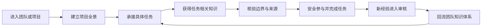
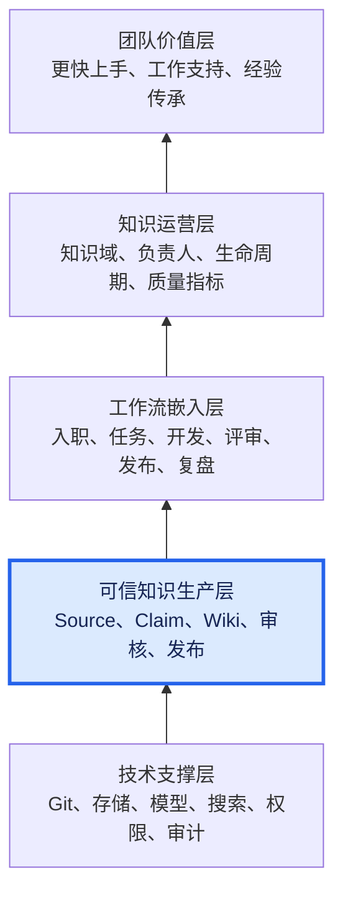
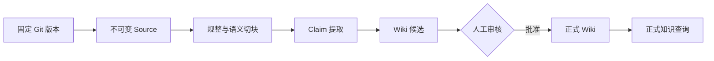

---
tags:
  - project-evolution
  - 团队知识系统
  - 阶段汇报
  - 内容稿
status: draft
authors:
  - human-team-sponsor
  - model-opencode
audience: management
presentation_duration: 15-20分钟
---

> **内容稿草案**：供汇报人阅读和备忘。当前按章节共同编写，仅第一部分进入评审，其余部分尚未定稿。

# AI 时代团队知识系统阶段进展汇报：内容稿

## 一、传统时代与 AI 时代的知识管理对比

### 1.1 传统知识管理的核心问题不是“没有文档”，而是“知识无法持续维护”

传统知识管理通常依赖团队成员主动撰写文档、选择目录、添加标签、维护链接，并在业务变化后继续更新。这个模式在知识规模较小时可以运行，但随着项目、人员和文档数量增长，维护成本会比知识价值增长得更快。

最终结果往往不是团队缺少文档，而是文档逐渐出现重复、冲突、过期和孤立：同一个问题散落在多份材料中，旧结论没有被新事实替换，关键经验停留在个人记忆或聊天记录里。传统 Wiki 最终往往会因为维护成本过高而失效。

传统搜索改善了“找到文件”的效率，但没有解决“理解多个来源、识别冲突并形成可复用结论”的问题。读者仍需自行阅读和拼接信息，而这部分理解成果通常不会回到知识库。

### 1.2 普通 RAG 改善了问答体验，但没有形成知识复利

普通 RAG 的典型方式是：保存一批原始文档，在用户提问时检索相关片段，再由模型临时组织答案。它降低了每次查找和阅读资料的成本，但每次提问仍需要模型重新发现、理解和拼接知识。

一次高质量回答可能综合了五份文档、解释了矛盾并形成新的判断，但如果回答只停留在对话窗口中，下一次提问仍要重新完成同样的工作。系统积累了文件和索引，却没有积累已经完成的理解。

因此，普通 RAG 主要解决“如何更快回答当前问题”，而没有完整解决“如何让团队知识随着每次资料导入和问题探索持续增值”。

### 1.3 AI 时代需要把知识管理升级为持续生产系统

AI 时代的变化不是让模型替人写更多文档，而是改变知识的生产时点和维护方式：当新来源进入系统时，AI 就完成规整、提取、关联和综合，形成可审核的 Wiki 候选；当来源更新时，系统识别受影响的事实和页面，再生成新的候选版本。

高质量的查询、比较和分析也不再是一次性回答，而可以经过审核后归档回 Wiki，成为后续查询和决策可以直接复用的知识资产。知识不再在每次提问时从零推导，而是持续积累、建立关联并随新来源更新，由此形成“知识复利”。

| 对比维度 | 传统文档与 Wiki | 普通 RAG | AI 时代知识系统 |
|---|---|---|---|
| 知识生产 | 依赖人主动撰写和整理 | 查询时临时生成回答 | 新来源进入时持续生成候选知识 |
| 知识维护 | 人工更新目录、摘要和链接 | 主要维护文档索引 | AI 持续更新摘要、关联、冲突和影响页面 |
| 多来源综合 | 依赖个人经验和重复阅读 | 每次提问重新检索、拼接 | 综合结果沉淀为 Wiki，并随来源增量更新 |
| 知识复用 | 复用文档原文 | 当前回答复用有限 | Wiki、比较和分析成为长期资产 |
| 知识状态 | 新旧结论容易混杂 | 依赖回答时的检索结果 | 区分来源版本、候选知识和已批准知识 |
| 人的职责 | 撰写、分类和维护为主 | 提问、核对回答 | 选择来源、提出问题、审核和作出决策 |
| AI 的职责 | 无 | 检索、拼接和回答 | 规整、提取、关联、综合和持续维护 |
| 主要风险 | 过期、重复、无人维护 | 幻觉、临时拼接、成果不沉淀 | 错误可能被持续放大，因此必须建立审核治理 |

### 1.4 人机分工的底线：AI 生产候选，人类对知识负责

AI 可以承担传统知识管理中最耗时、最容易被放弃的工作，包括格式规整、摘要维护、交叉引用、冲突提示和增量更新。但 AI 不对事实批准负责，也不能自行决定某项结论已经成为团队知识。

人的职责不会消失，而是从大量文档搬运和重复维护，转向更高价值的工作：选择可信来源、界定适用范围、判断证据是否支持结论、处理冲突，并批准最终知识。系统中的模型输出默认只能是候选知识；只有经过明确的人类审核，才能成为搜索、问答和决策所依赖的正式知识。

第一部分的结论是：我们要建设的不是“传统 Wiki 加聊天机器人”，而是一套由 AI 承担知识生产与维护、人类承担事实判断与治理责任的持续知识系统。

---

## 二、设计全景（最终目标）

### 2.1 最终目标：让成员更快参与工作，更安全地完成工作

这套知识体系的最终价值不是提供一个新的问答工具，而是让团队成员更快理解项目、更快上手、更安全地参与实际工作。

新员工是最典型的使用场景，但系统服务于整个团队。新成员需要快速建立项目全景，理解核心术语、组件关系和工作边界；有经验的成员在进入陌生模块、处理复杂问题或接手历史项目时，同样需要准确、贴合当前任务且能够核验的知识。

目标不是让员工阅读更多资料，而是缩短从“接触项目”到“能够参与实际工作”的路径：

这条路径同时解决四个问题：建立项目全景、独立承接任务、安全实施变更，以及减少对资深成员口口相传的依赖。

### 2.2 知识应在工作路径中渐进式出现

传统知识库通常把所有文档放在同一个入口，要求员工自行判断应该先看什么、哪些内容仍然有效、当前任务与哪些资料相关。最终设计将知识组织方式从“按文件存放”转向“按工作需要交付”。

| 工作阶段 | 需要获得的知识 | 系统应提供的能力 |
|---|---|---|
| 初次进入项目 | 项目目标、核心术语、系统边界、组件全景 | 提供结构化项目 Wiki 和推荐学习路径 |
| 开始承接任务 | 相关组件、流程、历史决策、前置条件 | 根据项目、组件和任务定位相关知识 |
| 分析具体问题 | 当前结论、冲突、不确定项、适用版本 | 展示知识状态、适用边界和关联事实 |
| 实施系统变更 | 关键约束、影响范围、操作边界 | 提供可核验依据，提示受影响知识和风险 |
| 完成任务之后 | 新事实、决策、经验和纠正 | 形成候选知识，经审核后回流 Wiki |

Wiki、搜索和 AI 问答都是知识的交付界面。它们可以帮助员工在不同阶段找到和理解知识，但它们不是最终价值。真正的价值在于员工是否因此更快建立全景、减少重复询问、找到适用于当前任务的依据，并完成可靠交付。

### 2.3 三层知识模型保证知识准确且可核验

系统以 Source、Claim 和 Wiki 三个核心概念组织知识：

| 层次 | 含义 | 解决的问题 |
|---|---|---|
| Source | 固定版本的原始代码、Issue、PR、文档或制度 | 原文是什么，发生争议时到哪里核验 |
| Claim | 从来源中提取的细粒度事实或主张 | 哪一项结论由什么证据支持，是否存在冲突或过期 |
| Wiki | 面向成员阅读的项目全景、解释、比较和操作知识 | 如何让事实能够被理解、学习并用于实际工作 |

### 2.4 完整愿景不只有知识生成

团队知识管理不能只建设一条 Source 到 Wiki 的生成流水线。完整愿景包含五个层次：底层技术提供运行基础，可信知识生产层把来源加工成可审核知识，工作流嵌入层让知识在实际任务中出现，知识运营层明确责任和生命周期，最终服务于成员上手、日常工作和经验传承。

| 愿景层次 | 需要解决的问题 | 当前状态 |
|---|---|---|
| 团队价值层 | 是否让成员更快上手、减少重复咨询并支持经验传承 | 目标已明确，尚待真实指标验证 |
| 知识运营层 | 管理哪些知识、谁负责、如何更新和淘汰 | 尚未建立 |
| 工作流嵌入层 | 知识如何进入入职、任务、开发、评审和复盘 | 尚未建立 |
| 可信知识生产层 | 如何把真实来源加工为可追溯、可审核的知识 | 原型已验证，当前所在位置 |
| 技术支撑层 | 模型、存储、权限、搜索和审计如何可靠运行 | 最小骨架已完成，生产能力待补齐 |

因此，当前工作不是完整的团队知识管理系统，而是其中的底层可信知识生产原型。它验证了 AI 生成的知识可以被来源约束、程序定位和人工治理，但还没有回答团队究竟需要管理哪些知识、由谁负责、如何进入工作流程，以及如何持续运营。

完整建设需要两项能力同时推进：

| 团队知识运营体系 | AI 知识生产能力 |
|---|---|
| 识别项目、流程、决策、操作和经验等关键知识域 | 从真实来源中规整、提取和综合知识 |
| 为知识域和来源指定负责人 | 保存证据、版本、冲突和审核状态 |
| 设计知识产生、使用、反馈和更新机制 | 根据来源变化生成新的候选版本 |
| 将知识嵌入入职、任务、评审、发布和复盘 | 降低人工整理、关联和维护成本 |
| 用成员上手和重复咨询等指标衡量价值 | 用完整性、定位和状态门禁保证产物质量 |

“准确”不仅表示模型生成的文字听起来合理，还必须同时满足三个条件：与当前任务相关，明确适用的版本、时间、环境和前置条件，并且能够打开原始来源核验。

详细的文件路径、块 ID 和行号保留在机器审计记录中，面向员工的 Wiki 则提供清晰、适量的人类可读来源。这样既避免可读文档被技术定位淹没，也不牺牲追溯能力。

### 2.5 内外双链路形成统一但隔离的知识供给

团队实际工作所需的知识同时来自公开工程和内部资料。最终系统采用两条物理隔离、知识模型统一的链路。

| 边界 | 规则 |
|---|---|
| 公开域到内网 | 允许通过白名单知识仓只读拉取 |
| 内网到公开域 | 默认禁止，不允许系统自动发布 |
| 内部模型调用 | 内部原文、Prompt、Embedding、检索上下文和日志均不得发送到外部托管模型 |
| 内部知识公开 | 必须先形成脱敏、审核并重新分类为公开的新 Source，再走受控发布流程 |

两条链路共用 Source、Claim、Wiki 和审核规则，但部署、数据、凭据、模型上下文和日志完全隔离。这样既能利用公开工程资料帮助成员理解代码和社区协作，也能在内网补充制度、内部设计和操作经验。

### 2.6 AI 负责持续维护，人类保留最终治理权

当新来源进入或旧来源发生变化时，AI 负责识别相关事实和受影响页面，形成新的 Wiki 候选。系统不无痕覆盖旧知识，而是保留来源版本、候选版本和审核记录。

只有经过人工批准的 Wiki 才能成为普通搜索、学习和 AI 问答默认使用的正式知识。候选内容可以进入审核区，但必须明确提示状态，不能直接用于制度执行、生产操作或安全决策。

员工在工作中形成的新事实、决策和经验，也不是直接写入正式知识，而是作为新的来源或候选进入同一审核闭环。这保证了知识可以持续增长，但知识责任不会转移给模型。

### 2.7 最终价值的验证方式

设计是否成功，不能只看生成了多少页面、模型回答了多少问题，而应看它是否改善团队成员参与实际工作的效率。

| 待验证指标 | 观察目标 |
|---|---|
| 首次独立完成任务时间 | 新成员从进入项目到独立完成第一个有效任务所需时间是否缩短 |
| 重复咨询量 | 围绕基础背景、历史约束和操作方式反复询问资深成员的次数是否下降 |

当前阶段尚未采集这两个指标的正式基线。后续应在小范围真实使用中记录现状，再比较知识体系投入前后的变化。

第二部分的结论是：我们的目标是改善团队成员上手、工作和经验传承。为此，需要同时建设团队知识运营体系和 AI 知识生产能力。目前先完成了底层可信知识生产原型，验证 AI 能否将真实来源加工成可追溯候选知识；下一步必须从“生成知识”转向“管理团队知识”。

---

## 三、当前进展与验证结果

### 3.1 阶段判断：从架构设计进入可运行原型验证

当前项目处于原型验证期。项目已经完成从理念整理、正式架构设计到公开 GitHub 黄金链路可运行骨架的跨越，并用两个真实仓库进行了验证。当前结果证明核心链路可以运行，但不代表生产系统已经完成。

放到五层完整愿景中看，当前主要完成的是“可信知识生产层”的原型验证，并为技术支撑层搭建了最小骨架。知识运营层和工作流嵌入层尚未建立，因此当前成果不能等同于完整团队知识管理体系。

| 已经完成 | 尚未完成 |
|---|---|
| 公开 GitHub 单仓固定版本导入 | 内部正式 PDF 与内网模型链路 |
| Source、规整、Claim、Wiki 候选完整链路 | 企业身份、RBAC 和职责分离 |
| 人工批准、正式知识发布和 approved-only 查询 | 支持驳回、纠正标注和新旧版本审核的门户 |
| 模型 Profile、生成 Prompt 和输出契约 | GitHub Issue、PR、Review、CI 的增量接入 |
| Source 完整性、候选隔离和文档格式门禁 | 面向团队成员的项目全景、任务知识和搜索入口 |

因此，当前可以准确表述为：**可信知识生产层已验证，正在向团队知识运营层推进；可运行原型已经完成，但尚未进入生产化和团队规模化使用阶段。**

### 3.2 已形成的可运行能力

当前 `knowledge-core` 已经跑通以下纵向链路：

| 能力 | 已实现内容 | 管理价值 |
|---|---|---|
| 来源冻结 | 固定 Git revision、子目录范围、内容哈希和完整性校验 | 确保知识能够回到当时的原始证据 |
| 内容规整 | 将支持的文本文件切分为带稳定 ID 的语义块 | 为模型理解和程序定位建立统一输入 |
| Claim 提取 | 模型负责陈述、类型和适用边界，程序负责证据位置 | 分离语义判断和精确定位职责 |
| Wiki 生成 | 固定生成 Prompt、输出契约、表格和 Mermaid 规则 | 形成结构一致、面向阅读的候选知识 |
| 生成后校验 | 检查章节顺序、表格结构、Mermaid 和展示规则 | 不合格文档不能进入候选产物 |
| 人工治理 | 模型内容默认 `pending-review`，批准后才成为正式知识 | AI 无权自行发布团队知识 |
| 正式知识查询 | 普通查询只读取已批准 Wiki | 防止候选内容混入日常使用 |
| 自动测试 | 12 项 CLI 测试全部通过 | 验证纵向链路和关键安全不变量 |

模型调用已经通过可配置 Profile 与知识逻辑解耦，并完成 DeepSeek V4 Flash 的真实接入。密钥不进入项目、日志或产物，正式部署时可切换为环境变量注入。

工程已正式入仓：`knowledge-core`、正式架构和长期生成规则已经推送到 `yyl-support/openKnowledgeBase`。仓库建立了与 `codeSource/` 同级的 `knowledgeManagement/` 和 `output/`，前者承载知识管理工程与规则，后者被规定为正式生成文档的统一出口；实验数据、候选文档和日常工作记录不进入公开仓。

### 3.3 两个真实仓库验证

#### 验证一：真实报告集的证据定位

第一个样本为 `yyl-support/file` 固定版本下的 8 份真实报告，共 34,942 个字符，规整后形成 127 个语义块。实验目标不是验证模型能否写出一段流畅总结，而是验证生成的 Claim 是否能准确回到支持它的原始证据。

| 版本 | 定位方法 | 正确结果 | 验证结论 |
|---|---|---:|---|
| v1 | 模型直接返回行号 | 5/10 | 模型可以理解内容，但精确行号不稳定 |
| v2 | 增强生成要求，仍由模型返回行号 | 3/10 | Prompt 改善语义边界，不能解决定位问题 |
| v3 | 程序语义切块，模型只选择块 ID | 10/10 | 证据定位进入可人工审核标准 |

该实验得到一个对后续架构非常关键的结论：**定位是程序问题，语义是模型问题，事实是否成立是人工审核问题。**

- 模型负责理解内容、生成陈述并识别时间、环境和条件边界。
- 程序负责冻结来源、生成稳定块 ID、映射文件和行号。
- 人工负责判断证据是否真正支持陈述，并决定是否批准。

#### 验证二：复杂知识仓的全景生成

第二个样本为 `yyl-support/openKnowledgeBase`。该仓库不是单一业务代码，而是包含组织概览、服务地图、来源清单和服务级知识的外网知识仓。

| 项目 | 结果 |
|---|---:|
| Git 跟踪文件 | 54 个 |
| 进入当前规整器的文本文件 | 52 个 |
| 语义块 | 275 个 |
| 模型提取 Claim | 18 条 |
| 生成结果 | 一份全仓知识全景候选 |

这次验证覆盖了组织级聚合统计、24 个服务注册项、七类服务地图、48 个服务级 Markdown 文件，以及公开内容、受控来源和授权 API 元数据之间的边界。生成结果经过两轮迭代，补齐了数据表格、服务清单、来源边界和文档展示规则。

两个实验共同证明：当前原型不仅可以处理小型演示材料，也可以冻结真实仓库版本、规整较复杂的知识结构、生成可审计 Claim，并形成面向人阅读的 Wiki 候选。

第三部分的结论是：我们已经回答了“这条知识生产链路能否运行”的问题；下一阶段要回答的是“如何完成内部知识接入、审核治理，并在真实团队工作中产生可衡量价值”。

---

## 四、下一步计划

### 4.1 阶段目标：从生成知识转向管理团队知识

下一阶段不以继续增加资料类型或建设完整门户为首要目标，而是选择一个真实团队、一个项目和一类实际任务，把现有可信知识生产原型放进团队工作场景中。

需要验证的核心问题是：当成员开始执行一项任务时，系统能否提供足够准确、贴合当前上下文并且可以核验的知识，帮助其理解系统、遵守历史约束、完成操作和处理异常。

试点任务不由技术实现单方面决定，而由试点团队从真实工作中共同筛选。选择时需要同时考虑业务价值、任务边界、现有来源、成员参与条件和验证可行性，避免为了迁就当前 CLI 能力而选择一个没有实际意义的演示任务。

| 试点维度 | 计划范围 | 选择原则 |
|---|---|---|
| 团队 | 一个团队 | 有明确负责人，愿意参与知识梳理和使用反馈 |
| 项目 | 一个项目 | 边界相对清晰，具有真实任务和可核验来源 |
| 任务 | 一类实际任务 | 由团队共同筛选，能够进行真实成员演练 |
| 使用者 | 任务经验不足或首次接触相关模块的成员 | 能够真实暴露知识缺口，而不是由原作者自我验证 |

### 4.2 第一步：建立试点知识域地图

在生成文档之前，先围绕试点任务回答“完成这项工作需要知道什么”。知识域地图不以已有文件目录为边界，而以成员完成任务的工作路径为边界。

| 知识域 | 需要梳理的内容 |
|---|---|
| 任务知识 | 目标、输入、输出、前置条件和完成标准 |
| 项目知识 | 项目定位、核心术语、相关模块和仓库入口 |
| 系统知识 | 组件关系、数据或控制流程、上下游依赖 |
| 决策知识 | 历史选择、替代方案、设计原因和不可破坏约束 |
| 操作知识 | 执行步骤、验证方式、常见异常和回退路径 |
| 经验知识 | 高频问题、失败案例、隐性规则和例外情况 |
| 制度知识 | 与任务相关的安全、权限、审批和合规要求 |

地图还要标记每个知识域当前是否已有可信来源、是否只存在于资深成员经验中、是否存在冲突或过期风险。由此形成的不是一份文档清单，而是一张“任务需要的知识与当前缺口”清单。

### 4.3 第二步：建立责任与运营机制

团队知识管理不能只依赖 AI 自动生成。每类知识必须明确由谁提供来源、谁判断其有效、谁负责审核，以及发生什么变化时需要更新。

| 运营事项 | 需要明确的规则 |
|---|---|
| 知识范围 | 哪些内容属于本次试点，哪些暂不纳入 |
| 来源责任 | 谁保证代码、文档、决策或操作记录是有效来源 |
| 内容审核 | 谁判断 Claim 和任务知识是否准确、完整且适用 |
| 使用反馈 | 成员在哪里报告缺失、错误、难以理解或已经过期的知识 |
| 更新触发 | 代码、流程、制度或任务边界变化后，哪些知识需要重新审核 |
| 内容退出 | 无效、过期或被新决策替代的知识如何标记和停止使用 |

这一步的目标不是立即设计完整企业流程，而是为试点建立最小可运行的知识责任闭环。没有明确责任人的知识，即使模型能够生成，也不能被视为稳定的团队知识。

### 4.4 第三步：形成任务知识样板

基于知识域地图和运营规则，使用当前可信知识生产原型处理真实来源，并形成一套围绕任务组织的知识样板。样板不是一篇大而全的项目介绍，而是一组能够支持成员完成任务的结构化知识。

| 样板模块 | 主要内容 | 使用价值 |
|---|---|---|
| 任务说明 | 目标、前置条件、输入输出和完成标准 | 让成员知道任务到底要求什么 |
| 系统上下文 | 相关组件、流程、上下游和影响范围 | 避免只会执行步骤而不理解系统 |
| 决策与边界 | 历史决策、设计原因、替代方案和关键约束 | 防止变更破坏既有设计边界 |
| 执行与排障 | 操作步骤、验证方式、常见问题和回退路径 | 支持实际执行和异常处理 |
| 来源核验 | 关联代码、Issue、PR、设计文档或制度 | 让关键结论能够回到原始依据 |

AI 负责从来源中规整、提取和组织候选内容；领域成员负责补充隐性知识、判断适用边界和审核最终样板。试点过程本身也用于发现：哪些团队经验尚未形成可用来源，哪些内容不能仅通过仓库和文档生成。

### 4.5 第四步：通过评审和真实成员演练验证

试点不能只以“生成了文档”作为完成标准，需要同时进行内容评审和真实成员演练。

| 验收方式 | 验证内容 |
|---|---|
| 文档评审 | 任务知识是否结构完整、表达清楚、边界准确、来源可核验 |
| 真实成员演练 | 一名不熟悉该任务的成员能否依靠样板理解任务并完成演练 |
| 缺口记录 | 演练中仍需询问资深成员的环节、无法理解的术语和缺失来源 |
| 结果复盘 | 哪些知识真正帮助工作，哪些内容只是增加阅读负担 |

首次试点重点获得真实反馈和可复用方法，不在汇报中预先承诺固定周期或夸大指标改善。演练结束后，再根据实际情况建立“首次独立完成任务时间”和“重复咨询量”的观测基线。

### 4.6 第五步：由真实缺口决定技术建设顺序

内部 PDF、Issue/PR、审核门户、搜索、权限和增量同步都属于可能需要的能力，但不应脱离试点场景并行铺开。下一轮技术优先级应由试点中的真实阻塞决定。

| 如果试点暴露的问题是 | 优先建设能力 |
|---|---|
| 关键知识集中在内部正式资料 | 内部 PDF 规整与内网模型链路 |
| 历史决策主要存在于协作记录 | GitHub Issue、PR、Review 和 CI 接入 |
| 审核过程难以执行或追踪 | Web 审核门户、身份与权限 |
| 成员难以在任务中找到相关页面 | 搜索、任务入口和上下文组织 |
| 来源变化后知识无法及时更新 | 增量同步、影响分析和重新审核 |

这一路径避免先投入建设完整平台，再寻找能够证明价值的使用场景。每一项新增能力都应能够对应一个真实工作缺口，并说明它如何帮助成员更快上手、减少重复咨询或更安全地完成任务。

### 4.7 下一阶段交付结果

下一阶段至少形成三项正式成果：

| 交付物 | 内容 |
|---|---|
| 知识域地图 | 一类真实任务所需的知识、现有来源和缺口 |
| 责任与运营机制 | 知识范围、来源负责人、审核方式、反馈和更新规则 |
| 试点知识样板 | 能够支持真实成员任务演练的结构化、可核验知识 |

第四部分的结论是：下一步不再以“模型还能生成什么”为中心，而要围绕“团队成员在实际任务中需要什么知识、由谁负责、如何验证有效”推进。可信知识生产原型将作为基础能力服务试点，而不是继续独立扩张为一个与团队工作脱节的工具平台。

---

## 五、来源

- [LLM Wiki 理念原文](https://gist.github.com/karpathy/442a6bf555914893e9891c11519de94f)
- [AI 时代团队知识系统第一阶段架构设计](../knowledgeManagement/architecture/AI时代团队知识系统-第一阶段架构设计.md)
