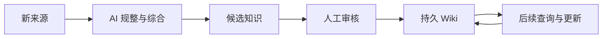
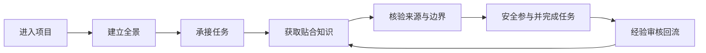
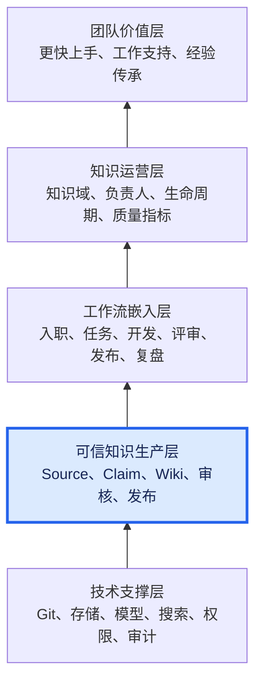
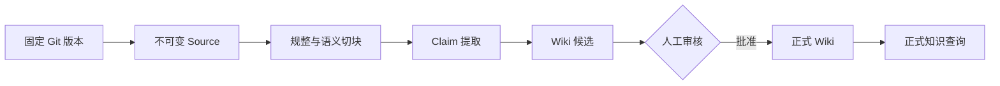
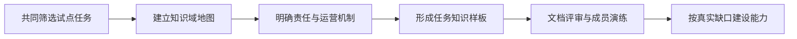

---
tags:
  - project-evolution
  - 团队知识系统
  - 阶段汇报
  - 演示稿
status: draft
authors:
  - human-team-sponsor
  - model-opencode
audience: management
presentation_duration: 15-20分钟
---

> **演示稿草案**：用于现场展示，与内容稿保持章节对应。当前仅第一部分进入评审。

# AI 时代团队知识系统阶段进展汇报：演示稿

## 一、传统时代与 AI 时代的知识管理对比

### 核心变化

> 从“保存文档、临时检索”，走向“持续生产、审核并积累知识”。

| 对比维度 | 传统文档与 Wiki | 普通 RAG | AI 时代知识系统 |
|---|---|---|---|
| 生产方式 | 人工撰写 | 查询时生成 | 来源进入时生成候选知识 |
| 维护方式 | 人工更新 | 维护索引 | AI 持续更新知识关联 |
| 多源综合 | 人工重复阅读 | 每次重新拼接 | 综合结果持续沉淀 |
| 主要产物 | 静态文档 | 一次性回答 | 可更新、可审核的 Wiki |
| 主要问题 | 维护成本过高，最终失效 | 理解成果不沉淀 | 必须防止错误持续放大 |

### 知识复利

- 每份来源只需被系统整理一次。
- 每次高质量分析都可以成为后续知识。
- 知识随来源和问题持续增长，而不是每次从零推导。

### 人机责任边界

| AI 负责 | 人负责 |
|---|---|
| 规整、提取、关联 | 选择可信来源 |
| 综合、更新、维护 | 判断证据与适用范围 |
| 生成候选知识 | 处理冲突、审核和批准 |

> AI 生产候选，人类对知识负责。

---

## 二、设计全景（最终目标）

### 最终目标

> 让团队成员更快理解项目、更快上手、更安全地参与实际工作。

- 新员工快速建立项目全景。
- 工作中获得与当前任务贴合的知识。
- 明确版本、环境、条件和操作边界。
- 减少对资深成员口口相传的依赖。

### 从学习到交付

| 工作阶段 | 知识支持 |
|---|---|
| 了解项目 | 项目全景、术语、组件和边界 |
| 承接任务 | 任务相关流程、历史决策和前置条件 |
| 实施变更 | 适用版本、关键约束和影响范围 |
| 完成工作 | 新事实、决策和经验进入审核闭环 |

### 完整愿景与当前位置

> **当前位置：可信知识生产层原型已验证，正在向团队知识运营层推进。**

| 愿景层次 | 当前状态 |
|---|---|
| 团队价值层 | 目标已明确，尚待真实指标验证 |
| 知识运营层 | 尚未建立 |
| 工作流嵌入层 | 尚未建立 |
| 可信知识生产层 | 原型已验证 |
| 技术支撑层 | 最小骨架已完成，生产能力待补齐 |

### 两项建设缺一不可

| 团队知识运营体系 | AI 知识生产能力 |
|---|---|
| 定义管理哪些知识 | 将真实来源加工为候选知识 |
| 明确知识负责人 | 保留证据、版本和审核状态 |
| 嵌入团队工作流程 | 自动规整、提取、关联和更新 |
| 衡量知识是否有效 | 降低重复维护成本 |

> 当前完成的是右侧的底层原型；下一步必须从“生成知识”转向“管理团队知识”。

| 安全规则 | 设计底线 |
|---|---|
| 公开知识进入内网 | 仅通过白名单仓库只读拉取 |
| 内部知识流向外网 | 默认禁止，不自动发布 |
| 内部模型调用 | 原文、Prompt、Embedding、上下文和日志均不出内网 |
| 知识批准 | AI 生成候选，人类最终批准 |

### 价值验证

| 待验证指标 | 期望变化 |
|---|---|
| 首次独立完成任务时间 | 缩短 |
| 重复咨询资深成员次数 | 降低 |

> Wiki、搜索和 AI 问答只是交付方式；最终价值是改善成员上手、工作和经验传承。

---

## 三、当前进展与验证结果

### 阶段判断

> 当前处于原型验证期：可运行原型已经完成，核心假设得到验证，尚未进入生产化阶段。

> 当前完成的是完整愿景中的“可信知识生产层”，不是完整的团队知识管理体系。

| 已经完成 | 尚未完成 |
|---|---|
| 公开 GitHub 单仓完整链路 | 内部正式资料链路 |
| Source、Claim、Wiki 候选链路 | 企业身份、权限和审核门户 |
| 人工批准与正式知识隔离 | GitHub Issue、PR、CI 增量接入 |
| 模型接入与文档质量门禁 | 面向团队的搜索与工作入口 |

### 已完成能力

| 能力 | 当前结果 |
|---|---|
| 来源冻结 | 固定 revision、范围、哈希和完整性校验 |
| 知识提取 | 模型生成 Claim，程序完成精确定位 |
| Wiki 生成 | 固定 Prompt、输出契约、生成后格式校验 |
| 知识治理 | 候选默认未审核，批准前不进入普通查询 |
| 工程验证 | 12 项 CLI 测试全部通过 |

### 两个真实仓库验证

| 验证样本                            |                     输入规模 | 重点验证       | 结果                   |
| ------------------------------- | -----------------------: | ---------- | -------------------- |
| `yyl-support/file`              | 8 个文件、34,942 字符、127 个语义块 | Claim 证据定位 | 三轮迭代后 10/10 定位正确     |
| `yyl-support/openKnowledgeBase` |        52 个文本文件、275 个语义块 | 复杂知识仓全景生成  | 提取 18 条 Claim，生成全景候选 |
|                                 |                          |            |                      |

| 第一轮实验演进 | 定位结果 |
|---|---:|
| v1：模型直接返回行号 | 5/10 正确 |
| v2：优化生成要求，仍由模型返回行号 | 3/10 正确 |
| v3：程序切块，模型选择块 ID | 10/10 正确 |

> 当前结论：公开 GitHub 知识生产链路已经具备可重复运行基础；下一步重点不再是证明“能不能生成”，而是补齐审核、内网资料和真实使用闭环。

---

## 四、下一步计划

### 下一阶段目标

> 从“生成知识”转向“管理团队知识”，验证知识能否真正支持成员完成一类实际任务。

| 试点范围 | 选择方式 |
|---|---|
| 一个团队 | 与试点团队共同确定 |
| 一个项目 | 选择边界清晰、具备真实使用条件的项目 |
| 一类任务 | 由团队从实际工作中共同筛选 |

### 五步推进路线

| 步骤 | 关键动作 | 主要产物 |
|---|---|---|
| 选择试点 | 明确团队、项目、任务和参与成员 | 试点范围 |
| 梳理知识 | 找出完成任务必需的知识及缺口 | 知识域地图 |
| 建立运营 | 明确来源、负责人、审核和更新方式 | 责任与运营机制 |
| 形成样板 | 用现有原型加工并组织任务知识 | 试点知识样板 |
| 验证迭代 | 评审内容，并让真实成员完成任务演练 | 验证结果与能力清单 |

### 任务知识样板

| 必备内容 | 解决的问题 |
|---|---|
| 任务说明 | 要做什么、前置条件和完成标准是什么 |
| 系统上下文 | 涉及哪些组件、流程和上下游 |
| 决策与边界 | 为什么这样做、哪些约束不能破坏 |
| 执行与排障 | 如何操作、验证、处理问题和回退 |
| 来源核验 | 关键结论能够回到代码、Issue、PR 或文档 |

### 试点验收

- 完成知识样板的结构、准确性和边界评审。
- 由不熟悉该任务的真实成员使用样板进行任务演练。
- 记录仍需咨询资深成员的环节和缺失知识。
- 根据真实缺口决定后续建设 PDF、Issue/PR、门户、搜索或权限能力。

> 不先建设完整平台，再寻找使用场景；先证明知识能够支持工作，再建设真正需要的技术能力。

---

## 五、来源

- [LLM Wiki 理念原文](https://gist.github.com/karpathy/442a6bf555914893e9891c11519de94f)
- [AI 时代团队知识系统第一阶段架构设计](../knowledgeManagement/architecture/AI时代团队知识系统-第一阶段架构设计.md)
- [阶段进展汇报内容稿](AI时代团队知识系统-阶段进展汇报-内容稿.md)
