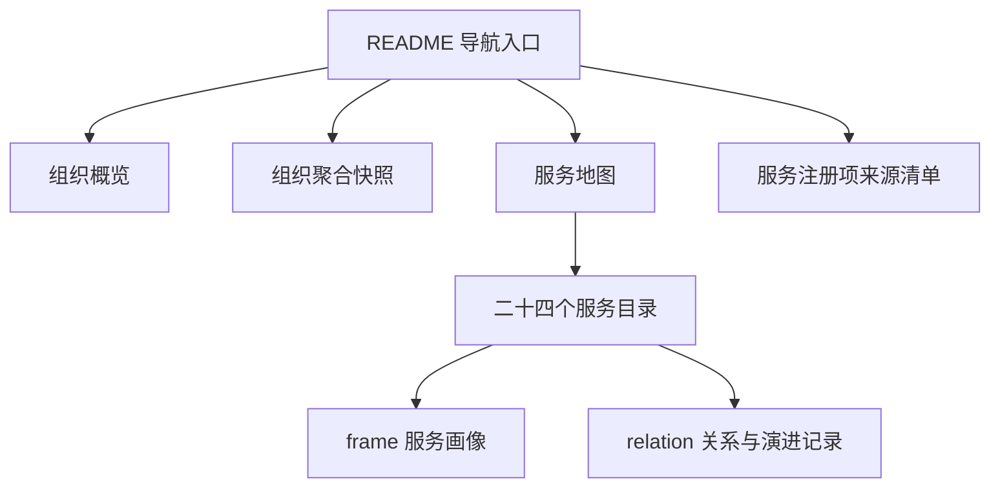

---
tags:
  - 知识实验
  - openKnowledgeBase
  - 外网知识库
  - 候选知识
wiki: openKnowledgeBase 外网知识库全景（v2 候选）
type: wiki-candidate
status: pending-review
authority: informative
authors:
  - model-deepseek-v4-flash-panorama
source:
  canonical_url: https://github.com/yyl-support/openKnowledgeBase
  revision: 1ecc8748fafa0c486fef3bad9c37c00f4d2d0ce0
  scope: full-repository
  source_id: source-git-579fe59c38f8db20
generation_instruction_hash: 2e7dd6bcf96e51b3f8286bf8b303ceded9615257904dd7d21a8c16dda5f7b4cc
candidate_id: wiki-candidate-140d46d77cbb0d88
claim_count: 18
reviewer_required: true
experiment: openKnowledgeBase-panorama-v2
---

> **未审核候选知识**：本文档基于固定版本源码和未审核 Claim 生成，所有内容均待人工审核，不得视为已批准事实。

# openKnowledgeBase 外网知识库全景

---

## 一、一句话说明

openKnowledgeBase 是 AI 时代团队的外网知识库总仓，用于发布可公开复核的组织级代码画像和服务知识，而不是承载业务系统源码。

---

## 二、整体概述

### 仓库定位

- `codeSource/` 沉淀组织概览、服务地图、来源范围和服务级知识，采用先稳定概览、后审核细节的渐进式披露方式。
- 知识只覆盖适合公开发布的内容，不收录凭据、密钥、令牌、内网地址、内部部署路径、集群网络细节和其他受限信息。
- 当前成品覆盖 24 个服务注册项及 48 个服务级 Markdown 文件，不代表 opensourceways 全部 450 个组织仓库都已形成服务文档。

### 信息架构

| 入口 | 主要用途 | 公开边界 |
|---|---|---|
| `README.md` | 仓库定位、导航、核心数量和敏感信息边界 | 本仓公开可复核 |
| `codeSource/org-overview.md` | 组织画像、服务分类、覆盖范围和来源限制 | 本仓公开可复核 |
| `codeSource/org-repos-snapshot.json` | 组织级仓库聚合统计 | 不含仓库清单和逐仓属性 |
| `codeSource/service-map.md` | 服务分类、项目标签、实现仓库和文档入口 | URL 不保证公开可访问 |
| `codeSource/source-registry.md` | 24 个注册项的受控来源快照 | 不复制 backlog 配置 |
| `codeSource/services/` | 每个服务的 `frame.md` 和 `relation.md` | 缺少证据时保留不足项 |

### 组织仓库画像

统计快照日期为 2026-08-04，来源为授权 GitHub API 的组织仓库元数据。公开仓库只保留聚合结果，不保存仓库清单、逐仓私有属性或私有源码。

| 指标 | 数量 | 口径说明 |
|---|---:|---|
| 组织仓库 | 450 | 授权 API 元数据聚合 |
| fork 仓库 | 42 | 组织仓库中的 fork |
| 归档仓库 | 246 | 不代表本仓发布其源码 |
| 私有仓库 | 397 | 不代表本仓发布其内部细节 |

| 排名 | 主要语言 | 仓库数 |
|---:|---|---:|
| 1 | Go | 160 |
| 2 | Unknown | 87 |
| 3 | Python | 75 |
| 4 | Java | 23 |
| 5 | Shell | 19 |
| 6 | Vue | 16 |
| 7 | JavaScript | 13 |
| 8 | HTML | 10 |
| 9 | Dockerfile | 8 |
| 10 | CSS | 7 |

| 推送活跃区间 | 仓库数 | 时间口径 |
|---|---:|---|
| 6 个月内 | 222 | 2026-02-04 及以后 |
| 6-24 个月 | 135 | 2024-08-04 至 2026-02-03 |
| 超过 24 个月 | 93 | 早于 2024-08-04 |

### 服务覆盖地图

| 分类 | 服务数 | 服务 ID |
|---|---:|---|
| identity | 3 | `cla-all`、`om-webserver`、`oneid-all` |
| robots | 2 | `forum-reply-robot`、`robot` |
| ci | 3 | `ascend-ci-project`、`calculator`、`ci-all` |
| data | 4 | `bigfiles-lfs-all`、`om-datacenter`、`oss-map`、`xihe` |
| package | 2 | `eur-build-all`、`software-package-all` |
| security | 3 | `certification-all`、`patch-manager`、`security-cve-all` |
| community | 7 | `etherpad-lite`、`hotopic-all`、`mailman`、`meeting-server`、`message-bus-all`、`pod-exporter-monitoring`、`search-all` |
| 合计 | 24 | 七个分类 |

### 服务文档模式

以下职责是从当前文件结构归纳出的阅读方式，不是仓库明示的正式接口定义。

| 文件 | 常见章节 | 阅读目的 |
|---|---|---|
| `frame.md` | summary、infrastructure、components、源码 | 快速了解服务定位、基础构成和源码入口 |
| `relation.md` | connection、evolution、deploy、facts_insufficient | 查看连接、演进、部署线索和证据缺口 |

---

## 三、事实陈述

- openKnowledgeBase 明确将自身定位为公开的团队外网知识库总仓。
- 当前 `codeSource` 成品覆盖 24 个服务注册项，每个服务对应一份 `frame.md` 和一份 `relation.md`，共 48 个服务级 Markdown 文件。
- 服务注册项来自 2026-08-04 通过已认证 GitHub API 读取的受控 backlog 配置，`project_label` 是 GitHub issue 路由标签，不是另一组服务数量。
- backlog 和部分源码 URL 需要组织权限，公开读者可能收到 404，URL 的存在不等于公开可访问。
- 服务地图提供分类、项目标签、实现仓库和服务文档入口；后续补充内容必须保留来源引用并通过公开发布边界审核。
- 服务文档在证据不足时保留 `facts_insufficient`，而不是补造组件、连接、演进或部署结论。

---

## 四、综合推断

- 本仓更接近“公开知识发布层”，而不是全量组织资产目录：450 是组织仓库统计，24 是本轮注册服务范围，48 是服务级文档数量。
- 仓库将人类可读知识与受控原始来源分开：公开读者可以检查本仓成品和聚合口径，但不能据此恢复私有仓库清单或受控配置全文。
- `frame.md` 与 `relation.md` 的双文档结构形成了“服务画像”和“关系、演进及证据缺口”两个阅读视角，但该归纳仍需人工确认是否适合作为长期模板定义。

---

## 五、已知限制与待确认事项

- [ ] 所有 18 条 Claim 仍待人工审核。
- [ ] 本轮只覆盖 24 个注册服务，其他组织仓库尚未生成服务文档。
- [ ] `source-registry.md` 未记录 backlog commit SHA，注册项来源不能精确冻结到 commit。
- [ ] 组织统计是 2026-08-04 的时间点快照，不能代表后续状态。
- [ ] 许多服务文档保留 `facts_insufficient`，具体组件、连接、演进和部署信息可能不完整。
- [ ] 不应从当前知识文档推断未明确记录的运行架构、调用关系、部署拓扑或安全细节。
- [ ] 重点复核 `claim-0ef88e8962389cb1`：其对 `frame.md` 和 `relation.md` 的职责描述属于结构归纳。

---

## 六、来源

| 来源 | 用途 | 可访问性 |
|---|---|---|
| [openKnowledgeBase](https://github.com/yyl-support/openKnowledgeBase) | 本次全仓固定版本 Source | 公开 |
| `README.md` | 仓库定位、目录、核心数量和安全边界 | 公开 |
| `codeSource/org-overview.md` | 组织画像、七类服务、覆盖范围和来源限制 | 公开 |
| `codeSource/org-repos-snapshot.json` | 组织级聚合统计 | 公开，但当前 CLI 不直接规整 JSON |
| `codeSource/service-map.md` | 服务分类与文档入口 | 公开 |
| `codeSource/source-registry.md` | 注册项范围、读取口径和访问限制 | 公开快照，原始 backlog 受控 |
| `codeSource/services/*/*/frame.md` | 服务画像 | 公开成品，部分源码 URL 可能受控 |
| `codeSource/services/*/*/relation.md` | 连接、演进、部署线索和证据不足项 | 公开成品，部分来源可能受控 |
| `opensourceways/backlog` | 服务注册配置原始来源 | 需要组织权限，公开读者可能收到 404 |

---

## 七、支撑论断

- 细粒度文件、块 ID、行号、证据原文、原始模型候选和生成要求保留在未发布的本地实验工作区。
- 本公开报告不复制 `.knowledge/` 实验数据；当前内容仅用于阶段验证，仍需依据固定 Source revision 进行人工审核。

---

## 八、审核状态

- [ ] 核对 18 条 Claim 的证据范围和陈述边界
- [ ] 复核服务双文档模式的结构归纳
- [ ] 确认组织统计口径与 2026-08-04 快照一致
- [ ] 确认受控来源、授权元数据和公开内容的边界表述
- [ ] 审核通过后再执行 CLI 批准流程

---

## 九、构建信息

| 字段 | 值 |
|---|---|
| Source | `https://github.com/yyl-support/openKnowledgeBase` |
| Revision | `1ecc8748fafa0c486fef3bad9c37c00f4d2d0ce0` |
| Source ID | `source-git-579fe59c38f8db20` |
| 冻结范围 | 全仓，54 个 Git 跟踪文件，约 79 KB |
| 规整结果 | 52 个受支持文本文件，275 个语义块 |
| 未直接规整 | `.gitignore` 与 JSON 聚合快照 |
| 生成模型 | `model-deepseek-v4-flash-panorama` |
| Claim 数量 | 18 |
| 候选 ID | `wiki-candidate-140d46d77cbb0d88` |
| 生成要求哈希 | `2e7dd6bcf96e51b3f8286bf8b303ceded9615257904dd7d21a8c16dda5f7b4cc` |
| 状态 | `pending-review` |
