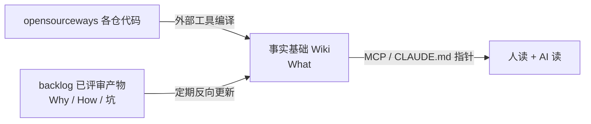

---
tags:
  - 知识管理
  - opensourceways
  - 代码知识
status: draft
date: 2026-08-07
scope: 只答三个问题——业界方案归纳 / 长期维护 / 快速应用
---

# opensourceways 代码知识：三问方案

聚焦外网 `github.com/opensourceways` 的**代码知识**。前提：**读代码生成 Wiki 这层不自研**，用成熟工具；自研只做「backlog 反哺 + 消费」。

---

## 问题一：业界方案的来源、逻辑链、核心思想

### 1.1 全部来源

| # | 方案（含来源 URL） | 逻辑链 | 核心思想 | 可借鉴 |
|---|---|---|---|---|
| 1 | [TencentCloud/TencentDB-Agent-Memory](https://github.com/TencentCloud/TencentDB-Agent-Memory) | 对话/文档/代码 → 四类记忆资产（Chat Memory / Skill / **Wiki** / **CodeGraph**）→ Hub 治理 → 按身份装配给 Agent | 凡能让下一个 Agent 少走弯路的信息都该被保存、组织、复用 | **已实测代码，见 1.3** |
| 2 | [Tencent/WeKnora](https://github.com/Tencent/WeKnora) | 文档 → RAG → 自主推理 Agent → **自维护 Wiki** | Self-maintaining Wiki | 「自维护」作为目标态 |
| 3 | [SonicBotMan/wiki-kb](https://github.com/SonicBotMan/wiki-kb) | 源 → **编译时写入** → 结构化真相 + 时间线 + 实体注册表 | 编译时写入，而非查询时检索 | 编译式 + LLM 审计追踪 |
| 4 | [AgriciDaniel/claude-obsidian](https://github.com/AgriciDaniel/claude-obsidian) | 文件 → AI 自动阅读/建链 → 知识图谱 | 纯 Markdown，数据完全自有 | 载体开放 + 自动建链 |
| 5 | [deepwiki-open](https://github.com/AsyncFuncAI/deepwiki-open) | 仓 → 向量库 → Web Wiki + RAG 问答 | 代码即知识源 | 交互体验好；但产物不落文件 |
| 6 | [open-zread](https://github.com/bb-boy680/open-zread) · [zread.ai](https://zread.ai/) | 仓 → CLI 编译 → Markdown + Mermaid + **diff-aware sync** | 一条命令出 Wiki，文档随代码同步 | 产物即文件 + diff 同步 |
| 7 | [Egonex-AI/Understand-Anything](https://github.com/Egonex-AI/Understand-Anything) | 仓 → 多 agent 管线 → 知识图谱 + 导览 + chat | 长在 coding agent 里 | 插件形态 = 零成本进工作路径 |
| 8 | [colbymchenry/codegraph](https://github.com/colbymchenry/codegraph) | 仓 → 预索引符号 / 文件 / 调用关系 | 预索引的代码图谱 | 被 #1 直接复用的底座 |
| 9 | [nousresearch/hermes-agent](https://github.com/nousresearch/hermes-agent) | 对话 → 提炼可复用 Skill（版本/触发边界/验证规则） | Skill 不只是 Prompt | 被 #1 复用于 Skill 资产 |
| 10 | [siyuan-note/siyuan](https://github.com/siyuan-note/siyuan) | 本地优先 → 双向链接 + 块引用 | Local-first、块级引用 | 块级引用 → 精确定位 |
| 11 | [Confluence + Atlassian Intelligence](https://www.techtarget.com/searchenterpriseai/feature/10-top-AI-knowledge-management-platforms-for-businesses) | 人写 → AI 辅助检索 → 深度集成 Jira | 与工单系统打通 | **「效果取决于内容结构和治理纪律」** |
| 12 | [Guru](https://helpjuice.com/blog/open-source-knowledge-base) | 人写 → AI 校验时效 → 浏览器扩展推送 | 在工作流程中提供知识 | 扩展形态：不要求用户切换应用 |
| 13 | [Coworker](https://coworker.ai/blog/knowledge-management-tools) | 连 50+ 数据源 → 统一索引 → 带来源依据的答案 | 消除信息孤岛 | 答案必须带来源依据 |
| 14 | [Wonderchat Workspace](https://wonderchat.io/blog/best-km-tools-enterprise) | 一个知识库 → 同时服务内部员工与外部客户 | 单一真源、多交付界面 | 真源单一、界面可多 |
| 15 | [KMS Lighthouse](https://www.analyticsinsight.net/artificial-intelligence/7-best-ai-knowledge-management-systems-for-enterprise-teams-2026) | 多源导入 → 索引 → 查询时生成 | 准确性与可操作性 | 「准确性」作为一等指标 |
| 16 | [BookStack / DokuWiki / Wiki.js / MediaWiki / XWiki](https://helpcenter.io/blog/10-open-source-knowledge-base-software-solutions/) | 人写 → 人分类 → 人维护 | 结构化存放 | DokuWiki 纯文本无数据库 → 载体开放 |
| 17 | Notion / 语雀 / 飞书文档 / 石墨 / 腾讯文档（详见[全景图](./知识管理系统全景图.md)§三） | 人写 → 实时协作 → 生态内分发 | 降低写作与协作摩擦 | 长在 IM/生态里 → 知识在工作路径上 |
| 18 | PingCode / 亿方云 / Worktile / MM-Wiki / MinDoc（详见[全景图](./知识管理系统全景图.md)§三） | 人写 + RAG → 私有化部署 | 安全合规优先 | 私有化部署形态（内网链路参考） |

> **#1 的组装策略本身就是结论**：CodeGraph 复用 #8、Skill 复用 #9、Wiki 理念来自 Karpathy。**腾讯也不自己造读代码的轮子。**

**理念源头**（不是方案，是这批 AI 原生方案共同的第一性原理起点）：[Karpathy「LLM Wiki」Gist](https://gist.github.com/karpathy/442a6bf555914893e9891c11519de94f) —— **「LLM 在每次查询时从头重新推导知识，没有积累。」** #1 #2 #3 #4 均明确致谢或引用。

### 1.2 归纳：五条跨代不变量 + 四条代际分水岭

**不变量**（上表 18 项全部成立，违反任一条无论多新都会死）：

| 不变量 | 第一性原理 |
|---|---|
| 真源单一，交付界面可多 | 同一事实存在两份可写副本必然冲突 → **副本数 > 1 是腐烂的充分条件** |
| 知识出现在工作路径上，非独立入口 | 注意力稀缺 → 要求「先想起再切过去」的设计必然输 |
| 载体开放、可版本化 | 封闭载体让知识寿命 = 工具寿命 |
| 治理纪律权重 > 工具功能 | 价值来自可信，可信来自责任归属 → **无责任人的知识只是待验证字符串** |
| 关系与结构是一等公民 | 孤立 N 条事实价值为 N，连接后接近 N² |

**分水岭**（#1–#8 具备，#11–#18 不具备）：

| 分水岭 | 第一性原理 |
|---|---|
| **理解发生在编译时，非查询时** | 查询时理解成本 `O(查询次数)` 且不留资产；编译时是 `O(变更次数)` → **知识复利只能在编译时产生** |
| 维护从人工转事件驱动自维护 | 维护量须与变更量成正比，不与知识总量成正比 |
| 来源锚定 + 审计从加分项变强制项 | 产量提升同时放大错误传播：错误 Claim 会被引进 N 个页面、M 次 agent 决策 |
| 主要产能来自隐性知识显性化 | 已有文档是存量且早被搜索覆盖，增量在没写下来的部分 |

### 1.3 TencentDB-Agent-Memory 的具体借鉴（已实测代码）

仓库已 clone 至 `/Users/gorden/huawei/code/TencentDB-Agent-Memory`（MIT，Node ≥22）。与我们相关的是 `MemoryKnowledge` 模块（69 文件 = Wiki + CodeGraph + MCP）。

| 文件 | 机制 | 我们的用法 |
|---|---|---|
| `ingest-v2/merge.ts` | **四档合并策略** | 参照，见 2.5 |
| `ingest-v2/cascade.ts` | 删源级联 + 悬空 `[[wikilink]]` 清理 | 解决引用完整性腐烂 |
| `ingest-v2/frontmatter.ts` | 页契约 `type/title/sources/tags/timestamp/locked`；**`buildPage` 永不写 `locked`** | 机器无法自锁、只能被锁 → 人工修改绝对优先 |
| `mcp/tools.ts` | `wiki_search`（BM25 + graph 多跳）/ `wiki_read` / `wiki_list` / `wiki_graph` + 8 个 `code_*` | MCP 契约直接参照，不必自定 |
| `engines/code/bridge.ts` | 封装 `@colbymchenry/codegraph` | 印证「不造轮子」 |

**不采用**：Chat Memory L0–L3 四层（服务对话记忆，我们知识源是代码与已评审文档）、Skill 资产（backlog `context/experience` 已有路径）、MemoryPanel 治理面板（200 文件，过重，我们走 Git + PR）、整套四模块部署。

**它自己承认未解决**：全自动记忆路由仍在迭代 → 「知识该自动给谁」这个问题业界都没答案。

### 1.4 自检：我们缺什么

| 条目 | 状态 |
|---|---|
| 真源单一 | ✅ 只读上游、只写我方产物仓 |
| **知识在工作路径上** | ❌ **最大缺口**，只有 CLI |
| 载体开放 | ✅ Markdown + Git + PR |
| 治理纪律 | ⚠️ 责任人/知识域未定 |
| 关系一等公民 | ❌ 线性文档，无实体/依赖图 → 可借 CodeGraph 补 |
| 编译时理解 | ⚠️ 思路对，但 knowledge-core **未经完整验证**，改由外部工具承担 |
| **事件驱动自维护** | ❌ **最大缺口**，全手动 |
| 来源锚定 + 审计 | ✅ 块 ID 定位可用 |
| 隐性知识显性化 | ⚠️ **backlog 197 份已评审文档是金矿，尚未接入** |

---

## 问题二：方案（长期维护部分已标注）

### 2.1 主链路

**差异化不在编译，在反哺**——外部工具只能答 What，`backlog` 才有 Why/How/坑。

### 2.1.1 事实基础生产方案：待定，未拍板

已定的只有一条**方向**：不自研读代码生成 Wiki 的能力，用成熟工具。**具体用哪个尚未决定**，下表列候选与取舍供决策，不预设结论。

| 候选 | 产物 | 形态与成本 | 满足不变量三（载体开放） | 附带能力 | 主要顾虑 |
|---|---|---|---|---|---|
| [open-zread](https://github.com/bb-boy680/open-zread) | Markdown 文件 + Mermaid | CLI，可进 CI，最轻 | ✅ | diff-aware sync | 社区项目，成熟度未验证；无代码图谱 |
| [MemoryKnowledge](https://github.com/TencentCloud/TencentDB-Agent-Memory)（#1 的单模块） | Markdown 文件 + frontmatter | 需 Node ≥22 + 数据库，较重 | ✅ | **CodeGraph（callers/callees/impact）+ MCP 12 工具 + merge/cascade 全套** | 能否只用单模块不起整套四模块，待验证 |
| [Understand-Anything](https://github.com/Egonex-AI/Understand-Anything) | 知识图谱 + 导览 | Claude Code 插件，零服务器 | ⚠️ 产物形态待确认 | 天然在 agent 工作路径上 | 产物是否可落 Git 文件待验证 |
| [deepwiki-open](https://github.com/AsyncFuncAI/deepwiki-open) | Web Wiki（服务内） | 前后端 + 向量库 | ❌ 产物不落文件 | RAG 问答体验最好 | **违反不变量三**，不建议 |

**建议的决策方式**：取一个 opensourceways 仓（如 forum-reply-robot），前三个候选各跑一遍，比产物质量、落地成本、是否可进 Git。实测后再定,不靠文档推演。

**决策待你确认**——这是本方案唯一悬空项，其余部分（2.2 起）与选哪个候选无关，可先推进。

### 2.2 knowledge-core 处置

前提修正：**它未经完整验证与迭代，不作既有资产默认沿用。**

| 组件 | 处置 |
|---|---|
| Source 冻结 / 规整 / Claim 提取 / Wiki 生成 | **弃用**（外部工具承担） |
| 块 ID 锚定（v3 实验 10/10） | **保留**——反向更新必须定位「改哪页哪段」 |
| `wiki_validation` 门禁 | 保留 |

三个定位实验的**结论**仍有效（定位是程序问题、语义是模型问题、事实是人工审核问题），但结论不等于实现必须留着。

### 2.3 【长期维护】机制一：不维护 Wiki，只维护编译器

Wiki 是 build artifact。页面错了不改页面，改 prompt / 描述符 / 章节契约后重编译。人的维护对象从「N 个页面」收缩为「1 套规则 + 每仓 1 份描述符」。

### 2.4 【长期维护】机制二：backlog 双回路反哺

**为什么以 backlog 为权威源**：产物均经线上人员评审合入，**可信度由既有流程担保，我们不必重建审核体系**。这是它最实质的价值——直接消掉了分水岭三（来源锚定 + 人工审核）通常最贵的那部分成本。

**实测供给量（2026-08-07，origin/main）**：

| 沉淀位置 | 数量 | 能否反哺代码事实基础 |
|---|---:|---|
| `issue_docs/*/Requirement Analysis` | **152** | ✅ 主来源（每 issue 必产） |
| `issue_docs/*/Architecture Design` | **45** | ✅ 主来源（Why 密度最高） |
| `issue_docs/*/Test` | 11 | ⚠️ 补充 |
| `changelogs/workflow_*` | **588** | ❌ 反哺 workflow，不反哺代码 |
| `changelogs/workflow_release` | **0** | ❌ |
| `context/experience`（阶段 E 产物） | **4，最近 2026-04-20** | ❌ 该环已断，见 2.6 |

| 回路 | 增量源 | 反哺对象 | 频率 |
|---|---|---|---|
| **A（主）** | 需求分析 + 架构设计，按 `project:<svc>` 路由到仓 | 该仓 Wiki 的 Why/决策/坑 章节 | 每周 |
| B | 588 条 changelog 聚类 | workflow 自身 + `spec` 仓经验 | 每月 |

**两类更新触发机制不同，不可混**：

| 变化 | 检测 | 动作 |
|---|---|---|
| 代码变了 | diff 命中 code globs | **重编译**该页（What 过期） |
| 有了新 Why/坑 | 新 issue_docs 合入 | **追加/修订**章节（What 未变，理解变深） |

> 边界：只读上游 + 只写我方产物仓，**不改任何线上 workflow**。定时脚本拉取，不要求 backlog 侧配合改造。

### 2.5 【长期维护】机制三：合并与级联（参照 TencentDB-Agent-Memory 实现）

> 与 2.1.1 的候选选择无关：无论最终用哪个工具产生事实基础，反向更新时都要解决「新知识怎么并进旧页」和「删源后引用怎么清理」。以下机制来自 #1 的已实测实现，可直接参照或复用。

**四档合并策略**（`merge.ts`）：

| 情况 | 动作 | 目的 |
|---|---|---|
| 目标页 `locked: true` | **跳过，绝不覆盖** | 保护人工编辑（硬约束） |
| 候选正文已被旧页覆盖 | **不调 LLM**，只更新 `sources` 并集 | 省 token |
| 旧页 ≤ 4000 字符 | 整页重写 | 质量优先 |
| 旧页 > 4000 字符 | **追加模式**：LLM 只产出增量片段，旧正文原样保留 | 省 output token + **不丢旧事实** |

两个关键设计：

- **冲突不裁决**：`If old and new conflict, keep both and explicitly note the disagreement` —— 并存 + 显式标注，判断权留给人。
- **`locked` 不对称**：`buildPage` 永不写 `locked`，只有人工 `page/write` 才注入 → 机器无法自锁，只能被锁。

**级联清理**（`cascade.ts`）：删源时按各页 `sources` 级联——独占该源的页删除、共享的页重写去源；删页时清理其他页指向它的悬空 `[[wikilink]]`，替换为可读文本而非留死链。解决知识库长期运行必然出现的**引用完整性腐烂**。

### 2.6 【长期维护】机制四：陈旧度可度量

每页 frontmatter 记 `source_commit`。陈旧度 = 该 commit 与当前 HEAD 之间命中该页 code globs 的提交数。

| 指标 | 用途 |
|---|---|
| 页面陈旧度 | 排重编译优先级 |
| 回源有效率 | 锚点仍指向存在 file:line 的比例，可自动校验 |

分级审核（全人工审核 = 退回传统模式）：结构类（组件/依赖/目录）门禁通过即自动合入；Why/决策/坑 必须人工审核；回源失效自动标 `stale`，不静默删除。

### 2.7 顺带发现的 backlog 缺陷（可反哺 workflow）

**`knowledge-summary.yml` 是孤儿 workflow。** 它的自动触发是 `repository_dispatch(type=requirement-shipped)`，但 release-mgmt 侧只发 `release-notify`（`workflow_release_pipeline.yml:1213`）；全仓搜索 `requirement-shipped` 除该 workflow 自身与 `workflow-design.md` 的设计描述外**无任何发送方** → 自动触发永不发生，只能手动 `workflow_dispatch`。这解释了 `context/experience` 近四个月无新增、`workflow_release` 复盘为空。

**设计文档描述的链路与实现不一致**，建议单独提 backlog issue 修复。另发现三处数据质量问题：`Architecture Desgin` 拼错 2 处、`Architecture%20Design` URL 编码未解 1 处 —— 做仓路由归集时必须做目录名归一化，否则漏文档。

---

## 问题三：local-debug 作为试验田——能在哪些阶段发挥作用

**硬约束**（`LOCAL-DEBUG.md:136`）：真跑会 push 分支 / 评论 / 开 PR / 真部署，**只能用专门的调试 issue**，不能拿真需求 issue 跑。

| 流水线阶段 | 线上 workflow | local-debug 覆盖 | 命令 | 能验证什么 |
|---|---|---|---|---|
| A 需求分析 | `issue-1-analyze-requirement.yml` | ❌ 无 | — | — |
| **B 需求实现（preview）** | `issue-2-implement.yml` | ✅ `local-debug.sh` | `dev` / `deploy` / `run` | **AI 真改代码——token 消耗最大、最值得测注入知识的收益** |
| **B 需求实现（submit）** | 同上 `/ai-develop-submit` | ✅ `local-debug.sh` | `submit` | 门禁 + review + tester 是否因知识注入而更准 |
| **测试策略生成** | `architecture-to-test.yml` | ✅ `local-debug-test.sh` | `<issue号>` | 有无架构 Wiki 时测试策略质量差异 |
| 测试用例聚合 | `aggregate-integration-tests.yml` | ✅ `local-debug-test.sh` | `aggregate` | 融入 integration-tests 的 diff |
| **C 上线测试发布** | `issue-3-release.yml` | ✅ `local-debug-issue-3.sh` | `<issue号>` | 服务解析 / 构建单元枚举 / tag 归档 dry-run（确定性校验，Windows 可跑） |
| E 知识沉淀 | `knowledge-summary.yml` | ❌ 无（且线上链路已断，见 2.7） | — | — |

**三种用法**：

| 用法 | 目的 |
|---|---|
| **量化实验台** | 对照组裸跑 vs 实验组注入 Wiki，同 issue 各跑 3 次取中位数，测 token + 耗时 + 质量。`dev` 阶段最值得测 |
| **新人训练场** | 走一遍真流程看 AI 怎么干活，可随时 `clean`、不影响线上。新人最大障碍不是读不懂代码，是不敢动手 |
| 日常真需求 | **不走 local-debug**，知识经 umbrella `CLAUDE.md` 指针进入线上 agent 上下文 |

产物只落 `~/issue2-debug/`，跑完 `clean`；并清理调试 issue 上的评论与 PR。

---

## 来源

外部方案的 URL 已就地标在 §1.1 表内，不重复罗列。其余来源：

- [知识管理系统全景图](./知识管理系统全景图.md) —— §1.1 中 #11–#18 的样本出处
- `TencentCloud/TencentDB-Agent-Memory` 已 clone 至本地，§1.3 的机制均来自实际代码阅读，非二手信息
- backlog 本地仓（`origin/main` @ 2026-08-07）：`docs/workflow-design.md`、`docs/local-debug/`、`issue_docs/`、`changelogs/`、`.github/workflows/knowledge-summary.yml`
- release-mgmt 本地仓：`.github/workflows/workflow_release_pipeline.yml:1213`（§2.7 断链证据）
