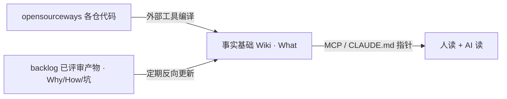

---
tags:
  - 知识管理
  - opensourceways
  - 代码知识
status: draft
date: 2026-08-07
---

# opensourceways 代码知识：三问方案

## 问题一：业界方案

| # | 方案 | 逻辑链 | 核心思想 |
|---|---|---|---|
| 1 | [TencentDB-Agent-Memory](https://github.com/TencentCloud/TencentDB-Agent-Memory) | 对话/文档/代码 → 四类资产（Chat Memory/Skill/Wiki/CodeGraph）→ Hub 治理 → 按身份装配给 Agent | 凡能让下一个 Agent 少走弯路的信息都该被保存、组织、复用 |
| 2 | [WeKnora](https://github.com/Tencent/WeKnora) | 文档 → RAG → 自主推理 Agent → 自维护 Wiki | Self-maintaining Wiki |
| 3 | [wiki-kb](https://github.com/SonicBotMan/wiki-kb) | 源 → 编译时写入 → 结构化真相 + 时间线 + 实体注册表 | 编译时写入，而非查询时检索 |
| 4 | [claude-obsidian](https://github.com/AgriciDaniel/claude-obsidian) | 文件 → AI 自动阅读建链 → 知识图谱 | 纯 Markdown，数据完全自有 |
| 5 | [deepwiki-open](https://github.com/AsyncFuncAI/deepwiki-open) | 仓 → 向量库 → Web Wiki + RAG 问答 | 代码即知识源 |
| 6 | [open-zread](https://github.com/bb-boy680/open-zread) | 仓 → CLI 编译 → Markdown + Mermaid + diff-aware sync | 文档随代码同步 |
| 7 | [Understand-Anything](https://github.com/Egonex-AI/Understand-Anything) | 仓 → 多 agent 管线 → 知识图谱 + 导览 + chat | 长在 coding agent 里 |
| 8 | [codegraph](https://github.com/colbymchenry/codegraph) | 仓 → 预索引符号/文件/调用关系 | 预索引的代码图谱 |
| 9 | [hermes-agent](https://github.com/nousresearch/hermes-agent) | 对话 → 提炼 Skill（版本/触发边界/验证规则） | Skill 不只是 Prompt |
| 10 | [siyuan](https://github.com/siyuan-note/siyuan) | 本地优先 → 双向链接 + 块引用 | Local-first、块级引用 |
| 11 | [Confluence + AI](https://www.techtarget.com/searchenterpriseai/feature/10-top-AI-knowledge-management-platforms-for-businesses) | 人写 → AI 辅助检索 → 集成 Jira | 效果取决于内容结构和治理纪律 |
| 12 | [Guru](https://helpjuice.com/blog/open-source-knowledge-base) | 人写 → AI 校验时效 → 浏览器扩展推送 | 在工作流程中提供知识 |
| 13 | [Coworker](https://coworker.ai/blog/knowledge-management-tools) | 连 50+ 源 → 统一索引 → 带来源依据的答案 | 消除信息孤岛 |
| 14 | [Wonderchat](https://wonderchat.io/blog/best-km-tools-enterprise) | 一个知识库 → 同时服务内部员工与外部客户 | 单一真源、多交付界面 |
| 15 | [KMS Lighthouse](https://www.analyticsinsight.net/artificial-intelligence/7-best-ai-knowledge-management-systems-for-enterprise-teams-2026) | 多源导入 → 索引 → 查询时生成 | 准确性与可操作性 |
| 16 | [BookStack/DokuWiki/Wiki.js/MediaWiki/XWiki](https://helpcenter.io/blog/10-open-source-knowledge-base-software-solutions/) | 人写 → 人分类 → 人维护 | 结构化存放 |
| 17 | Notion/语雀/飞书/石墨/腾讯文档（[全景图](./知识管理系统全景图.md)§三） | 人写 → 实时协作 → 生态内分发 | 降低协作摩擦 |
| 18 | PingCode/亿方云/Worktile/MM-Wiki/MinDoc（[全景图](./知识管理系统全景图.md)§三） | 人写 + RAG → 私有化部署 | 安全合规优先 |

理念源头：[Karpathy「LLM Wiki」](https://gist.github.com/karpathy/442a6bf555914893e9891c11519de94f) —— 「LLM 在每次查询时从头重新推导知识，没有积累。」#1 #2 #3 #4 均致谢或引用。

### 结论

18 项全部成立的五条：

| 不变量 |
|---|
| 真源单一，交付界面可多 |
| 知识出现在工作路径上，非独立入口 |
| 载体开放、可版本化 |
| 治理纪律权重 > 工具功能 |
| 关系与结构是一等公民 |

#1–#8 具备、#11–#18 不具备的四条：

| 分水岭 |
|---|
| 理解发生在编译时，非查询时 |
| 维护从人工转事件驱动自维护 |
| 来源锚定 + 审计从加分项变强制项 |
| 主要产能来自隐性知识显性化 |

#1 的组装策略：CodeGraph 复用 #8、Skill 复用 #9、Wiki 理念来自 Karpathy。腾讯不自己造读代码的轮子。

### 我们的差距

| 条目 | 状态 |
|---|---|
| 真源单一 | ✅ |
| 知识在工作路径上 | ❌ |
| 载体开放 | ✅ |
| 治理纪律 | ⚠️ 责任人未定 |
| 关系一等公民 | ❌ |
| 编译时理解 | ⚠️ knowledge-core 未经验证 |
| 事件驱动自维护 | ❌ |
| 来源锚定 + 审计 | ✅ 块 ID 定位可用 |
| 隐性知识显性化 | ⚠️ backlog 197 份已评审文档未接入 |

---

## 问题二：方案

### 事实基础生产：待你拍板

| 候选 | 产物 | 成本 | 附带能力 | 顾虑 |
|---|---|---|---|---|
| [open-zread](https://github.com/bb-boy680/open-zread) | Markdown + Mermaid | CLI，最轻 | diff-aware sync | 成熟度未验证，无代码图谱 |
| [MemoryKnowledge](https://github.com/TencentCloud/TencentDB-Agent-Memory)（#1 单模块） | Markdown + frontmatter | Node ≥22 + 数据库 | CodeGraph + MCP 12 工具 + merge/cascade | 能否只起单模块待验证 |
| [Understand-Anything](https://github.com/Egonex-AI/Understand-Anything) | 知识图谱 + 导览 | Claude Code 插件，零服务器 | 天然在 agent 路径上 | 产物能否落 Git 待验证 |
| [deepwiki-open](https://github.com/AsyncFuncAI/deepwiki-open) | Web Wiki（服务内） | 前后端 + 向量库 | RAG 体验最好 | 产物不落文件 |

其余各节与选哪个候选无关。

### knowledge-core 处置

| 组件 | 处置 |
|---|---|
| Source 冻结 / 规整 / Claim 提取 / Wiki 生成 | 弃用 |
| 块 ID 锚定 | 保留 |
| wiki_validation 门禁 | 保留 |

### 【长期维护】机制一：不维护 Wiki，只维护编译器

页面错了改 prompt / 描述符 / 章节契约后重编译。维护对象 = 1 套规则 + 每仓 1 份描述符。

### 【长期维护】机制二：backlog 双回路反哺

backlog 产物均经线上评审合入，可信度由既有流程担保，不必重建审核。

实测供给量（origin/main @ 2026-08-07）：

| 沉淀位置 | 数量 | 能否反哺代码事实基础 |
|---|---:|---|
| `issue_docs/*/Requirement Analysis` | 152 | ✅ |
| `issue_docs/*/Architecture Design` | 45 | ✅ |
| `issue_docs/*/Test` | 11 | ⚠️ |
| `changelogs/workflow_*` | 588 | ❌ 反哺 workflow |
| `changelogs/workflow_release` | 0 | ❌ |
| `context/experience` | 4，最近 2026-04-20 | ❌ 链路已断 |

| 回路 | 增量源 | 反哺对象 | 频率 |
|---|---|---|---|
| A | 需求分析 + 架构设计，按 `project:<svc>` 路由 | 该仓 Wiki 的 Why/决策/坑 | 每周 |
| B | 588 条 changelog 聚类 | workflow + spec 仓 | 每月 |

| 变化 | 检测 | 动作 |
|---|---|---|
| 代码变了 | diff 命中 code globs | 重编译该页 |
| 有了新 Why/坑 | 新 issue_docs 合入 | 追加/修订章节 |

边界：只读上游 + 只写我方产物仓，不改线上 workflow。

### 【长期维护】机制三：合并与级联

参照 `TencentDB-Agent-Memory/MemoryKnowledge`（已 clone 本地）。

`ingest-v2/merge.ts` 四档策略：

| 情况 | 动作 |
|---|---|
| 目标页 `locked: true` | 跳过，绝不覆盖 |
| 候选正文已被旧页覆盖 | 不调 LLM，只更新 `sources` 并集 |
| 旧页 ≤ 4000 字符 | 整页重写 |
| 旧页 > 4000 字符 | 追加模式，LLM 只产出增量片段 |

冲突：并存 + 显式标注，不裁决。
`buildPage` 永不写 `locked`，只有人工 `page/write` 注入 → 机器无法自锁。

`ingest-v2/cascade.ts`：删源时按各页 `sources` 级联——独占该源的页删除、共享的页重写去源；删页时清理指向它的悬空 `[[wikilink]]`。

`mcp/tools.ts`：`wiki_search`（BM25 + graph 多跳）/ `wiki_read` / `wiki_list` / `wiki_graph` + 8 个 `code_*`（含 `code_impact`）。

不采用：Chat Memory L0–L3、Skill 资产、MemoryPanel、整套四模块部署。

### 【长期维护】机制四：陈旧度可度量

每页 frontmatter 记 `source_commit`。陈旧度 = 该 commit 与 HEAD 之间命中该页 code globs 的提交数。

| 指标 | 用途 |
|---|---|
| 页面陈旧度 | 排重编译优先级 |
| 回源有效率 | 锚点仍指向存在 file:line 的比例 |

分级审核：结构类门禁通过即自动合入；Why/决策/坑 必须人工审核；回源失效标 `stale`。

### backlog 缺陷（可反哺 workflow）

`knowledge-summary.yml` 自动触发为 `repository_dispatch(requirement-shipped)`，但 release-mgmt 只发 `release-notify`（`workflow_release_pipeline.yml:1213`），全仓无 `requirement-shipped` 发送方 → 自动触发永不发生。

数据质量：`Architecture Desgin` 拼错 2 处、`Architecture%20Design` URL 编码未解 1 处，仓路由归集需做目录名归一化。

---

## 问题三：local-debug 试验田

约束（`LOCAL-DEBUG.md:136`）：真跑会 push/评论/开 PR/真部署，只能用调试 issue。

| 流水线阶段 | 线上 workflow | 覆盖 | 命令 | 可验证 |
|---|---|---|---|---|
| A 需求分析 | `issue-1-analyze-requirement.yml` | ❌ | — | — |
| B 实现 preview | `issue-2-implement.yml` | ✅ `local-debug.sh` | `dev`/`deploy`/`run` | AI 真改代码，token 消耗最大 |
| B 实现 submit | `/ai-develop-submit` | ✅ `local-debug.sh` | `submit` | 门禁 + review + tester |
| 测试策略生成 | `architecture-to-test.yml` | ✅ `local-debug-test.sh` | `<issue号>` | 测试策略质量差异 |
| 测试用例聚合 | `aggregate-integration-tests.yml` | ✅ `local-debug-test.sh` | `aggregate` | 融入 integration-tests 的 diff |
| C 上线测试发布 | `issue-3-release.yml` | ✅ `local-debug-issue-3.sh` | `<issue号>` | 服务解析 / 构建单元枚举 / tag 归档 dry-run |
| E 知识沉淀 | `knowledge-summary.yml` | ❌ | — | 线上链路已断 |

| 用法 | 说明 |
|---|---|
| 量化实验台 | 裸跑 vs 注入 Wiki，同 issue 各跑 3 次取中位数，测 token + 耗时 + 质量 |
| 新人训练场 | 走真流程，可随时 `clean` |
| 日常真需求 | 不走 local-debug，知识经 umbrella `CLAUDE.md` 指针进入线上 agent |

---

## 来源

URL 已标在 §1.1 表内。其余：

- [知识管理系统全景图](./知识管理系统全景图.md) —— #11–#18 出处
- `TencentDB-Agent-Memory` 已 clone 本地，机制来自代码阅读
- backlog（`origin/main` @ 2026-08-07）：`docs/workflow-design.md`、`docs/local-debug/`、`issue_docs/`、`changelogs/`、`.github/workflows/knowledge-summary.yml`
- release-mgmt：`.github/workflows/workflow_release_pipeline.yml:1213`
